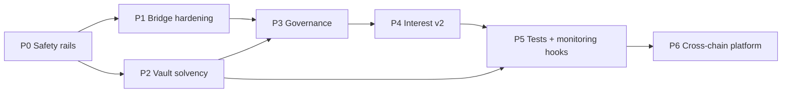

# Smart Contract Implementation Plan

> **Companion to:** [`production_upgrade_roadmap.md`](production_upgrade_roadmap.md)
> **Scope:** The Solidity / Foundry side only. This is the *executable* step-by-step plan — the roadmap says **what and why**, this says **do this, then this, in this file, verify like so**.
> **Golden rule:** Every phase must leave `forge build` + `forge test` green and the protocol *safer than before*. No phase is a rewrite.

## How to use this document

- Work **top to bottom**. Phases are ordered so each depends only on earlier ones.
- Each **Step** lists: files to add/modify, the exact function/event/error surface to introduce (names + signatures, not full bodies), how it wires to the rest, the tests that prove it, and a Done check.
- `[NEW]` = create file · `[MOD]` = modify existing · `[TEST]` = test file.
- Run the **verify block** at the end of every step before moving on.

## Current baseline (verified from source)

| File | State today |
|---|---|
| [src/RebaseToken.sol](src/RebaseToken.sol) | `ERC20 + Ownable + AccessControl`; global rate `5e10`; per-user rate + timestamp; lazy linear accrual; `MINT_AND_BURN_ROLE`; no pause |
| [src/Vault.sol](src/Vault.sol) | `deposit()` mints 1:1, `redeem()` burns + ETH `call`; `receive()`; no guard/pause/limits/fees/accounting |
| [src/RebaseTokenPool.sol](src/RebaseTokenPool.sol) | CCIP `TokenPool`; `lockOrBurn` encodes bare `uint256` rate; `releaseOrMint` decodes + mints; no versioning/replay set/limits |
| [src/interfaces/IRebaseToken.sol](src/interfaces/IRebaseToken.sol) | minimal interface |
| [script/](script/) | `Deployer`, `ConfigurePool`, `BridgeTokens`, `Interactions` |
| [test/](test/) | `RebaseToken.t.sol`, `CrossChain.t.sol` (fork) |
| CI | `.github/workflows/test.yml` — references `FOUNDRY_PROFILE: ci` **but `foundry.toml` has no `[profile.ci]`** |

## Target folder layout (grow into this)

```
src/
  token/RebaseToken.sol
  vault/Vault.sol  WithdrawalQueue.sol  IStrategy.sol
  bridge/RebaseTokenPool.sol  MessageCodec.sol  LaneRegistry.sol
  interest/InterestRateController.sol  IRateOracle.sol
  treasury/Treasury.sol
  governance/  (uses OZ Governor/TimelockController + Council multisig)
  safety/CircuitBreaker.sol  Pausable mixins
  interfaces/  libraries/Errors.sol
test/ unit/ integration/ fork/ invariant/ attack/
script/ deploy/ config/ ops/
config/chains.json
```

Move files in the phase where you first touch them; keep remappings/imports updated in the same commit so the build never breaks.

---

## Phase ordering at a glance



---

# PHASE 0 — Safety Rails

**Goal:** Gain the ability to *stop* and *scope authority* before adding any value logic.
**Difficulty:** ⭐⭐ · **Est:** 3–5 days · **Blocking:** everything.

### Step 0.0 — Fix CI profile & add tooling (do this first, 30 min)

- `[MOD]` [foundry.toml](foundry.toml): add a real `[profile.ci]` (e.g. `fuzz.runs = 1000`, `invariant.runs = 256`, `optimizer = true`) so the CI env is intentional, not a silent fallback to default.
- `[MOD]` [foundry.toml](foundry.toml): add `[profile.default.fuzz] runs = 256` and enable `via_ir` if stack-too-deep appears later.
- `[NEW]` `Makefile`: targets `build test fmt lint slither coverage snapshot`.
- Install static analysis: document `slither .` and (optional) `aderyn` usage.
- **Verify:** `FOUNDRY_PROFILE=ci forge test` runs with the new profile.

### Step 0.1 — Central error + role library

- `[NEW]` `src/libraries/Errors.sol`: house shared custom errors (keeps naming consistent across contracts).
- `[NEW]` `src/libraries/Roles.sol`: declare role constants — `MINT_AND_BURN_ROLE` (keep existing hash), `PAUSER_ROLE`, `UNPAUSER_ROLE`, `RATE_ADMIN_ROLE`, `FEE_ADMIN_ROLE`, `LANE_ADMIN_ROLE`, `TREASURER_ROLE`.
- **Interaction:** every contract imports role constants from here instead of redeclaring.

### Step 0.2 — Scoped pause on RebaseToken

- `[MOD]` [src/RebaseToken.sol](src/RebaseToken.sol):
  - Inherit OZ `Pausable`.
  - Add `pause()` (requires `PAUSER_ROLE`), `unpause()` (requires `UNPAUSER_ROLE`) — **asymmetric authority** (fast pause / slow unpause).
  - Gate `mint`, `burn`, `transfer`, `transferFrom` with `whenNotPaused`.
  - Keep `balanceOf` / view functions callable while paused (reads must never revert).
- **Trade-off note in NatSpec:** pausing transfers freezes the token; document it.

### Step 0.3 — Reentrancy guard + scoped pause on Vault

- `[MOD]` [src/Vault.sol](src/Vault.sol):
  - Inherit OZ `ReentrancyGuard` (or `ReentrancyGuardTransient` on Cancun+) and `Pausable` and `AccessControl`.
  - Add `pauseDeposits/pauseRedemptions` flags (scoped, not one global switch) with `PAUSER_ROLE`.
  - `deposit()` → `whenDepositsNotPaused nonReentrant`.
  - `redeem()` → `whenRedemptionsNotPaused nonReentrant`; **keep the existing CEI order** (burn → transfer) *and* add the guard (defense in depth).
  - Cap gas on the ETH `call` OR keep the check-return pattern (already present) — document the choice.
- **Interaction:** Vault holds `PAUSER_ROLE`-gated switches; the Guardian multisig (Phase 3) will hold the role.

### Step 0.4 — Role taxonomy + admin handover

- `[MOD]` [src/RebaseToken.sol](src/RebaseToken.sol): replace ad-hoc `onlyOwner` grants with explicit `AccessControl`; keep `Ownable` only if a dependency needs it, and point its owner at the (future) Timelock.
- Add two-step admin handover pattern (`beginAdminTransfer` / `acceptAdminTransfer`) so a fat-fingered address can't brick the protocol.
- `[MOD]` [script/Deployer.s.sol](script/Deployer.s.sol): after wiring roles, **transfer `DEFAULT_ADMIN_ROLE` to the intended admin and renounce the deployer's** — and assert it.

### Step 0.5 — Enable CCIP rate limits

- `[MOD]` [script/ConfigurePool.s.sol](script/ConfigurePool.s.sol) and the test config helper in [test/CrossChain.t.sol](test/CrossChain.t.sol):
  - Replace `RateLimiter.Config({isEnabled: false, capacity: 0, rate: 0})` with **enabled** inbound + outbound configs, parameterized from `config/chains.json`.
  - Starting values: `capacity` ≈ 5% of expected circulating supply per lane; `rate` = capacity / 4h.

### Phase 0 tests

- `[TEST]` `test/unit/Pause.t.sol`: every gated function reverts when paused; unpause requires the right role; reads work while paused.
- `[TEST]` `test/unit/AccessControl.t.sol`: role matrix — who can/can't call each privileged function; deployer has no residual admin after handover.
- `[TEST]` `test/unit/Reentrancy.t.sol`: a malicious `receive()` re-entering `redeem`/`deposit` reverts.
- `[MOD]` `test/CrossChain.t.sol`: add a case that bridges with limits **enabled** and asserts the throttle path.

### Phase 0 verify block

```bash
forge fmt && forge build --sizes
forge test --match-path "test/unit/*"
forge test --match-contract CrossChainTest
```

**Definition of Done:** every state-changing entrypoint is pausable + guarded; rate limits enabled; deployer admin renounced (tested); gas snapshot recorded (`forge snapshot`).

---

# PHASE 1 — Bridge Hardening

**Goal:** Versioned, hashed, replay-proof, rate-limited, observable cross-chain messages.
**Difficulty:** ⭐⭐⭐⭐ · **Est:** 1–2 weeks · **Depends on:** P0.

### Step 1.1 — Message codec library

- `[NEW]` `src/bridge/MessageCodec.sol`: a library that encodes/decodes the versioned payload.
  - Define a `struct BridgePayload { uint16 version; uint8 msgType; uint64 sourceChainSelector; address sender; uint256 userInterestRate; uint256 nonce; }` (described here; implement as a library).
  - `encode(BridgePayload) → bytes` using `abi.encode` (never `encodePacked` for hashed data).
  - `decodeVersion(bytes) → uint16` (read leading version before full decode).
  - `decodeV1(bytes) → BridgePayload`.
  - `hash(BridgePayload) → bytes32` = `keccak256(abi.encode(all fields, amount))`.
- **Constant:** `VERSION_1 = 1`, `MSG_TOKEN_TRANSFER = 1` (reserve `MSG_GOVERNANCE`, `MSG_RATE_SYNC`, `MSG_ACK` for P6).

### Step 1.2 — Lane registry

- `[NEW]` `src/bridge/LaneRegistry.sol` (or fold into the pool as a mixin):
  - `mapping(uint64 => LaneConfig) lanes` where `LaneConfig { address remotePool; address remoteToken; bool enabled; uint16 minVersion; }`.
  - `setLane(...)` gated by `LANE_ADMIN_ROLE` (→ Timelock later).
  - `mapping(uint16 => bool) supportedVersions` with governance setters.
- **Rollout discipline (document in NatSpec):** enable a new version on the **destination** before the **source** emits it; reverse to sunset.

### Step 1.3 — Rework the pool

- `[MOD]` [src/RebaseTokenPool.sol](src/RebaseTokenPool.sol):
  - **`lockOrBurn`:** build a `BridgePayload` (version, msgType, source selector, sender, rate, nonce++), set `destPoolData = MessageCodec.encode(payload)`. Consume the outbound rate-limit bucket. Emit `BridgeInitiated`.
  - **`releaseOrMint`:** decode version → dispatch → verify:
    1. `msg.sender` is the current router's registered OffRamp (trusted router check).
    2. `sourceChainSelector` is `enabled` in the lane registry.
    3. source pool == `lanes[selector].remotePool` (trusted remote).
    4. `version` in `supportedVersions`.
    5. recompute `hash` and compare (integrity).
    6. `messageId`/`hash` **not** in the replay set.
    Then consume inbound bucket → mint → mark executed → emit `BridgeCompleted` + `MessageExecuted`.
  - Add `override` to `releaseOrMint` (currently missing the explicit override) — verify against the CCIP `TokenPool` base signature.

### Step 1.4 — Replay set

- Add `mapping(bytes32 => bool) executedMessages` to the pool.
- Set **before** minting; `require(!executed[id])`.
- Emit `MessageExecuted(id)`. (Storage grows unbounded — accept as an immutable audit trail, or add an epoch-pruning function later.)

### Step 1.5 — Circuit breaker

- `[NEW]` `src/safety/CircuitBreaker.sol`:
  - Time-bucketed rolling counters of value in/out (avoid unbounded storage).
  - `checkAndRecord(inflow, outflow)` trips when net velocity > threshold.
  - On trip → calls the same pause entrypoints the Guardian uses (breaker = automated pauser).
  - Governance-only `reset()` with cooldown.
- **Interaction:** pool calls `checkAndRecord` in `lockOrBurn`/`releaseOrMint`.

### Step 1.6 — Bridge events

- Add the full event catalog to the pool: `BridgeInitiated`, `BridgeCompleted`, `MessageExecuted`, `MintFailed`, `RateLimitConsumed`, `LaneConfigured`, `AckReceived` (ACK unused until P6). Index `user`, `selector`, `payloadHash`.

### Phase 1 tests

- `[TEST]` `test/unit/MessageCodec.t.sol`: round-trip encode/decode; `decodeVersion` correctness; **fuzz malformed bytes → must revert, never mis-decode**; hash binding (changing any field changes the hash).
- `[TEST]` `test/unit/Replay.t.sol`: same `messageId` mints once; second attempt reverts.
- `[TEST]` `test/unit/TrustedRemote.t.sol`: untrusted pool/selector/version each revert.
- `[TEST]` `test/unit/CircuitBreaker.t.sol`: trips on simulated anomaly, pauses, resets with cooldown.
- `[MOD]` `test/CrossChain.t.sol`: add version-mismatch, paused-destination, and rate-limit-throttle fork cases.
- `[TEST]` `test/fork/BridgeChaos.t.sol`: late/failed/duplicate/reorg message simulations.

### Phase 1 verify block

```bash
forge build --sizes
forge test --match-path "test/unit/*"
forge test --match-path "test/fork/*"    # needs RPC secrets
```

**Definition of Done:** all messages versioned+hashed; replay impossible (proved by invariant in P5); untrusted sources rejected; breaker trips on simulation; bridge fully event-instrumented.

---

# PHASE 2 — Vault Solvency & Fees

**Goal:** Make yield *backed*, add capped revenue, resolve L3/L7/L8/L10.
**Difficulty:** ⭐⭐⭐⭐ · **Est:** 1.5–2 weeks · **Depends on:** P0.

### Step 2.1 — Liquidity accounting + backing invariant

- `[MOD]` [src/Vault.sol](src/Vault.sol):
  - Track `totalLiabilities` (mirror of redeemable RBT) and `backing` (ETH held + strategy value + reserve).
  - Expose views `reserveRatio()`, `freeLiquidity()`.
  - Enforce (or monitor) `backing >= liabilities`; if violated, block new deposits / enter recovery (Step 2.7).
- **This is the single most important vault change.** Everything else supports it.

### Step 2.2 — L10 rate reconciliation

- `[MOD]` [src/RebaseToken.sol](src/RebaseToken.sol) `mint(to, amount, rate)`:
  - Currently sets `s_userInterestRate[to] = rate` **unconditionally**.
  - Change to: zero balance → adopt bridged rate; non-zero balance → `s_userInterestRate[to] = min(existingRate, rate)`; and clamp so a bridge can never *raise* a user's rate above the current global rate.
- **Interaction:** aligns bridge-in with the existing transfer logic and the "rate only decreases" ethos.

### Step 2.3 — Reward + insurance reserve

- `[NEW]` `src/treasury/Treasury.sol`:
  - Holds protocol fees + reward reserve + insurance reserve (separate accounting buckets).
  - `fundReserve()`, `withdrawReserve()` (`TREASURER_ROLE` → Timelock), `absorbLoss()`.
  - Emits `FeeReceived`, `ReserveFunded`, `ReserveWithdrawn`, `StrategyLoss`.

### Step 2.4 — Capped fees

- `[MOD]` [src/Vault.sol](src/Vault.sol): add deposit/withdrawal/performance fees.
  - Each fee has a **hard-coded cap**; `FEE_ADMIN_ROLE` can set within `[0, cap]` only.
  - Fees route to `Treasury`; emit `FeeCharged(type, payer, amount)`.
  - **Performance fee applies to realized yield only — never to user principal.**

### Step 2.5 — Deposit/TVL/daily limits (guarded launch)

- `[MOD]` [src/Vault.sol](src/Vault.sol): add `maxDepositPerTx`, `maxDepositPerAddress`, `globalTvlCap`, `dailyNetFlowLimit` (time-bucketed), `minDeposit`. All `FEE_ADMIN_ROLE`/`LANE_ADMIN_ROLE`-tunable within caps.

### Step 2.6 — Withdrawal queue (pull-based)

- `[NEW]` `src/vault/WithdrawalQueue.sol`:
  - `requestRedeem(amount)` → burn/escrow RBT, record `{user, amount, requestTime}`.
  - `claim(requestId)` → pay ETH when liquid (pull; **no unbounded loops**).
  - `cancel(requestId)` → restore RBT.
  - FSM: `Requested → Claimable → Paid` / `Cancelled`.
- **Interaction:** `redeem()` serves from `freeLiquidity()` instantly; falls back to enqueue when liquidity is short.

### Step 2.7 — Strategy interface + recovery mode

- `[NEW]` `src/vault/IStrategy.sol`: `deposit()`, `withdraw(amount)`, `totalAssets()`, `harvest()`. (Concrete strategy optional this phase — a reward-reserve model satisfies backing without a live strategy.)
- `[MOD]` [src/Vault.sol](src/Vault.sol): `enterRecoveryMode()` (governance) — redeem-only, pro-rata if undercollateralized.
- **Rescue function:** add `rescueToken(token)` that **excludes RBT and backing ETH** (tested by invariant), Timelock-gated.

### Phase 2 tests

- `[TEST]` `test/invariant/Solvency.t.sol`: stateful handler firing deposit/redeem/transfer/accrue → assert `Σ balanceOf ≤ backing` after every action.
- `[TEST]` `test/unit/Fees.t.sol`: fee math; caps enforced; principal never taken as fee.
- `[TEST]` `test/unit/Limits.t.sol`: each limit reverts at boundary.
- `[TEST]` `test/unit/WithdrawalQueue.t.sol`: FSM legality; DoS-safety (pull-only); cancel restores.
- `[TEST]` `test/unit/RateReconciliation.t.sol`: L10 `min` rule across bridge-in/transfer.

### Phase 2 verify block

```bash
forge build
forge test --match-path "test/unit/*"
forge test --match-path "test/invariant/Solvency.t.sol"
```

**Definition of Done:** backing invariant enforced + invariant-tested; fees flow to Treasury within caps; guarded-launch limits active; queue survives a simulated liquidity crunch; L10 closed.

---

# PHASE 3 — Governance & Timelock

**Goal:** Separate powers; make value-changes delayed + vetoable. Resolve L5.
**Difficulty:** ⭐⭐⭐ · **Est:** 1–1.5 weeks · **Depends on:** P0–P2.

### Step 3.1 — Deploy Timelock, migrate admin

- Use OZ `TimelockController`.
- `[NEW]` `script/deploy/DeployGovernance.s.sol`: deploy Timelock; grant it `DEFAULT_ADMIN_ROLE` and every value-changing role on Token/Vault/Pool/Treasury/CircuitBreaker; **renounce all deployer/multisig direct roles** (except emergency, below).

### Step 3.2 — Governor (advisory → binding)

- Use OZ `Governor` + `GovernorVotes` + `GovernorTimelockControl`.
- Voting: balance-snapshot weight (add `ERC20Votes`-style checkpointing to RBT **or** a separate gov token), quorum ~4%, voting delay ~1d, period ~3–5d.
- Start **advisory** (team executes via Timelock), flip to **binding** once a voter base exists.

### Step 3.3 — Emergency Council + Guardian

- Emergency Council = Gnosis Safe (2-of-5) holding **only** `PAUSER_ROLE` and breaker-trip rights — **subtractive only** (cannot mint, move funds, or change rates).
- Guardian = role/multisig that can `cancel()` a queued Timelock proposal within the delay window.

### Phase 3 tests

- `[TEST]` `test/integration/Governance.t.sol`: full lifecycle propose→vote→queue→execute; delay enforced; Council can pause but **not** change value/rate; Guardian veto works; no residual unilateral owner anywhere.

### Phase 3 verify block

```bash
forge test --match-path "test/integration/Governance.t.sol"
```

**Definition of Done:** every value-changing action routes through Timelock; Council pauses fast but can't change value; deployer has zero residual power; governance flow tested end-to-end.

---

# PHASE 4 — Interest Model v2

**Goal:** Precision, path-independence, dynamic/oracle rates.
**Difficulty:** ⭐⭐⭐⭐⭐ (migration is delicate) · **Est:** 2–3 weeks · **Depends on:** P3.

### Step 4.1 — Checkpoint struct + events

- `[MOD]` [src/RebaseToken.sol](src/RebaseToken.sol): group per-user state into one struct/slot `Checkpoint { uint128 principal? , uint96 rate, uint40 timestamp }` (verify ranges vs. caps; see gas §11 of roadmap). Emit `InterestAccrued(user, from, to, amount, newPrincipal)`.

### Step 4.2 — Extract InterestRateController

- `[NEW]` `src/interest/InterestRateController.sol`: owns rate policy; `currentRate()`, `setPolicy(...)` (governed). Token asks the controller for the rate on deposit instead of holding policy itself.
- `[NEW]` `src/interest/IRateOracle.sol`: adapter over a Chainlink Data Feed with staleness + deviation + max-step guards.

### Step 4.3 — Index model (the big one)

- Introduce **bucketed share-indices** (recommended over a single global index because per-user rates are the product's identity):
  - Balance = `shares × index[rateTier]`.
  - One monotonic index per distinct rate tier; bound the number of tiers.
  - **Differential-test** the new model against the current linear model to characterize/prove equivalence.
- **Migration:** write a migration path that preserves existing balances with **no discontinuity** (snapshot old balances → seed shares at current index).

### Step 4.4 — Oracle-driven / scheduled rates

- Controller maps oracle value → rate within a governed band, with caps/floor/max-step-per-epoch. Reject stale/deviant rounds (hold last rate).

### Phase 4 tests

- `[TEST]` `test/invariant/InterestModel.t.sol`: precision/rounding invariants; `Σ balance ≤ backing` still holds under the index model.
- `[TEST]` `test/unit/Differential_LinearVsIndex.t.sol`: fuzz equivalence old vs new.
- `[TEST]` `test/unit/Oracle.t.sol`: staleness/deviation/max-step rejection paths.
- `[TEST]` `test/unit/Migration.t.sol`: no balance changes across migration.

### Phase 4 verify block

```bash
forge test --match-path "test/unit/Differential_LinearVsIndex.t.sol"
forge test --match-path "test/invariant/*"
```

**Definition of Done:** rate policy externalized + governed; index model live + differential-tested; oracle bounded + fault-tolerant; zero balance discontinuity across migration.

---

# PHASE 5 — Test Depth & Monitoring Hooks

**Goal:** Prove correctness; emit everything monitors need.
**Difficulty:** ⭐⭐⭐ · **Est:** 1.5–2 weeks · **Depends on:** P0–P4.

### Step 5.1 — Complete the event catalog

- Audit every contract for the roadmap §9.2 event list (Vault/Token/Pool/Treasury/Governance/Safety). Add missing before/after values on parameter-change events so indexers needn't reconstruct prior state.

### Step 5.2 — Invariant suite (the safety net)

- `[TEST]` `test/invariant/Protocol.t.sol` — one handler, all invariants:
  - Solvency `Σ balance ≤ backing`.
  - Supply consistency (`totalSupply == Σ principals` post-accrual).
  - Cross-chain conservation (`Σ minted_dest == Σ burned_src` per lane).
  - No replay (each messageId mints once).
  - Rate monotonicity (global rate never increases).
  - Rate reconciliation (no user rate exceeds entitled max after bridge).
  - Fee bounds (never exceed caps; principal never taken).
  - Reserve floor (never silently below floor without pause/recovery).

### Step 5.3 — Attack + chaos suites

- `[TEST]` `test/attack/*.t.sol`: reentrancy, cross-chain replay, spoofed source pool, rate front-run around scheduled change, oracle manipulation, queue griefing, fee/rounding extraction, role escalation — each **must fail to profit the attacker**.
- `[TEST]` `test/fork/BridgeChaos.t.sol` (extend P1): message never/late/failed/duplicate/reorg + rate-limit exhaustion mid-flow.

### Step 5.4 — Coverage + gas gates in CI

- `[MOD]` `.github/workflows/`: split into `ci.yml` (fmt, lint via solhint, build, unit+fuzz, `forge coverage` ≥95% line/≥90% branch, `forge snapshot` diff), `security.yml` (Slither/Aderyn + nightly deep invariant), `fork.yml` (RPC-gated).

### Phase 5 verify block

```bash
forge coverage --report summary
forge test --match-path "test/invariant/*" --match-path "test/attack/*"
forge snapshot --check
```

**Definition of Done:** ≥95%/≥90% coverage; every revert has a test; invariant + attack + chaos suites green; CI gates enforced.

---

# PHASE 6 — Cross-Chain Platform (v3+)

**Goal:** Cross-chain governance, staking, multi-token, multi-bridge.
**Difficulty:** ⭐⭐⭐⭐⭐ · **Est:** 4+ weeks · **Depends on:** P1–P5.

### Step 6.1 — Control-plane messages

- `[MOD]` `src/bridge/MessageCodec.sol`: add `MSG_GOVERNANCE`, `MSG_RATE_SYNC`, `MSG_ACK` structs + versions.
- `[NEW]` `src/governance/CrossChainExecutor.sol`: on a blessed `GOVERNANCE`/`RATE_SYNC` message from the canonical hub, apply the param change locally. **Auth:** trusted-remote + version + replay (reuse P1 gates).
- Add ACK channel: destination sends `MSG_ACK(payloadHash, success)` back; source tracks `messageStatus` with timeout→FAILED→retry.

### Step 6.2 — Global rate sync

- Designate a canonical chain (Ethereum) as source of truth for global rate + pause; spokes receive via `RATE_SYNC`/`HALT` messages and cannot set locally (except emergency local pause). Resolves cross-chain rate drift.

### Step 6.3 — Staking / multi-token / multi-bridge (optional, sequence as separate initiatives)

- `[NEW]` cross-chain staking contract with hub-synced stake state.
- `[NEW]` multi-token vault variant (per-asset rebase token + backing).
- `[NEW]` `src/bridge/IMessenger.sol` + adapters (CCIP primary; LayerZero/Hyperlane/Axelar/Wormhole adapters) so transport is swappable while app-level guarantees stay identical.

### Phase 6 tests

- `[TEST]` `test/fork/CrossChainGovernance.t.sol`: a hub vote provably updates a spoke param via a blessed, versioned, ACKed message; retry on failure; per-adapter parity if multi-bridge.

**Definition of Done:** hub vote → spoke param change end-to-end; every new capability carries the P1 security guarantees.

---

## Deployment & ops scripts (build alongside phases)

| Script | Phase | Purpose |
|---|---|---|
| `script/deploy/DeployCore.s.sol` | P0 | Token+Pool+Vault, config-driven from `config/chains.json` |
| `script/deploy/DeployGovernance.s.sol` | P3 | Timelock+Governor+Council; role migration + renounce |
| `script/config/ConfigureLane.s.sol` | P1 | Idempotent lane onboarding (registry + CCIP registry) |
| `script/config/VerifyDeployment.s.sol` | P0+ | Assert roles/limits/wiring; fail loudly on drift |
| `script/ops/Pause.s.sol` / `Retry.s.sol` / `Rescue.s.sol` | P0/P1/P2 | Runbook automation |

**Deterministic addresses:** use CREATE2 for Token/Pool so cross-chain addresses are predictable and lanes can be pre-configured.

## Global Definition of Done (per phase, every time)


## What to hand an auditor (after P5)

- All `needs-audit` components: MessageCodec, Pool, CircuitBreaker, Vault solvency, Treasury, Timelock wiring, index model migration.
- `docs/THREAT_MODEL.md`, `docs/SECURITY.md`, the invariant suite, and this plan.
