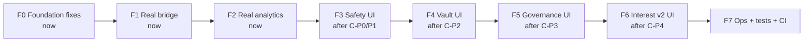
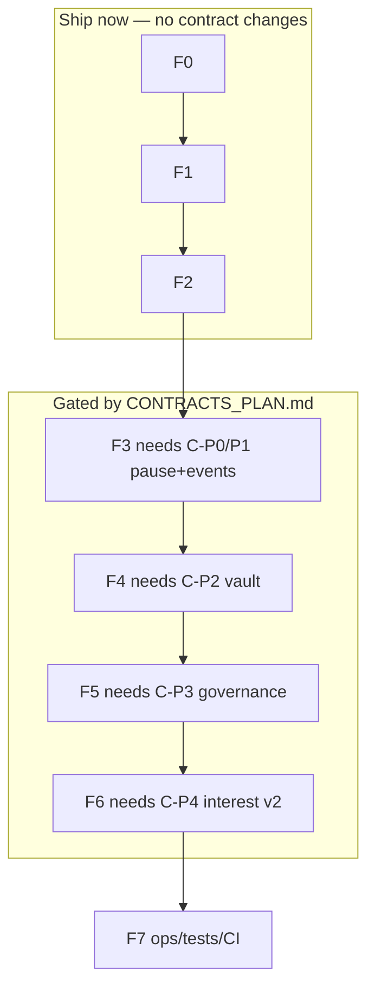

# Frontend Implementation Plan

> **Companion to:** [`../production_upgrade_roadmap.md`](../production_upgrade_roadmap.md) and [`../CONTRACTS_PLAN.md`](../CONTRACTS_PLAN.md)
> **Scope:** The Next.js dApp in `frontend/` only.
> **Guiding principle:** The frontend can only *surface* what exists on-chain. Each frontend phase is paired to the contract phase that unlocks it — don't build UI for a contract feature that isn't deployed yet. But the two functional gaps that already hurt the project (a **stubbed bridge** and **fake analytics**) are fixable **today** and come first.

## ⚠️ Read this before writing any code

`frontend/AGENTS.md` states this is **Next.js 16.2.6 with breaking changes vs. common training data**. Before writing components, routing, or data-fetching code, **read the relevant guide in `node_modules/next/dist/docs/`** and heed deprecation notices. This plan describes *what* to build; confirm the *exact* Next 16 API (App Router conventions, server/client boundaries, metadata, caching) against those docs.

## Stack (verified from `package.json`)

Next 16.2.6 · React 19 · wagmi 2 · viem 2 · RainbowKit 2 · @tanstack/react-query 5 · recharts 3 · framer-motion 12 · lucide-react · Tailwind 4. Styling today is mostly **inline styles + a few CSS utility classes** (`glass-card`, `btn-primary`, `input-field`) in `globals.css`, not Tailwind classes.

## Current state (verified from source)

| File | State today | Gap |
|---|---|---|
| [src/lib/contracts.ts](src/lib/contracts.ts) | Sepolia addresses real; `zkSyncSepolia`/pool non-Sepolia are `0x000…` placeholders; ABIs cover only view + approve + deposit/redeem | No pause/fee/queue/limit/governance ABIs; missing dest addresses |
| [src/hooks/useRebaseToken.ts](src/hooks/useRebaseToken.ts) | Reads balance/principal/rates/supply; **only really supports chainId 11155111**, else zero-address token | No multi-chain; no reserve/limit/pause reads |
| [src/app/bridge/page.tsx](src/app/bridge/page.tsx) | **`handleBridge` is a STUB** — shows a toast "Connect your actual CCIP router…" and never calls `ccipSend`; only `approve` works | The headline feature doesn't actually bridge |
| [src/app/analytics/page.tsx](src/app/analytics/page.tsx) | **Fully mocked** — `Math.random()` + simulated series, labeled "simulated" | No real on-chain data |
| [src/lib/wagmi.ts](src/lib/wagmi.ts) | `getDefaultConfig`, 3 chains, WalletConnect `projectId` falls back to `'demo_project_id'` | No real projectId via env |
| [src/lib/utils.ts](src/lib/utils.ts) | formatters + explorer links | **Bug:** `getChainColor(300)` returns `'8C8DFC'` (missing leading `#`) |
| Pages | home, deposit, dashboard, bridge, analytics | — |

---

## Phase map (aligned to contracts)

`C-Pn` = contract phase *n* from `CONTRACTS_PLAN.md`. F0–F2 need **no contract changes** and should ship first — they close the gaps a technical reviewer will actually click on.

---

# PHASE F0 — Foundation Fixes (do now, ~1 day)

**Goal:** Fix the small correctness/config gaps that undermine everything else.

### Step F0.1 — Environment & config hygiene

- `[NEW]` `frontend/.env.local.example`: `NEXT_PUBLIC_WALLETCONNECT_PROJECT_ID`, `NEXT_PUBLIC_ALCHEMY_KEY` (or per-chain RPC URLs), `NEXT_PUBLIC_DEFAULT_CHAIN`.
- `[MOD]` [src/lib/wagmi.ts](src/lib/wagmi.ts): require a real `projectId` (warn loudly if the `demo_project_id` fallback is used); wire per-chain `transports` to your own RPC keys instead of public defaults (rate-limit resilience).

### Step F0.2 — Fix the color bug + centralize chain metadata

- `[MOD]` [src/lib/utils.ts](src/lib/utils.ts): fix `getChainColor(300)` → `'#8C8DFC'` (leading `#` missing).
- `[NEW]` `src/lib/chains.ts`: single source of truth for chain metadata (id, name, icon, color, selector, explorer, token/pool/vault addresses). Have `utils.ts`, `wagmi.ts`, `contracts.ts`, and `bridge/page.tsx` import from here instead of each hardcoding a `CHAINS` array (the bridge page currently redeclares one).

### Step F0.3 — Address book keyed by chainId

- `[MOD]` [src/lib/contracts.ts](src/lib/contracts.ts): restructure addresses into `Record<chainId, { token, vault, pool }>` so `useRebaseToken` and the bridge can resolve by connected chain instead of the current `chainId === 11155111 ? … : zero` branch. Leave non-deployed chains explicitly `undefined` and have the UI show "not deployed on this chain yet."

### F0 Done

- No `0x000…` silently used as a real address; wrong-network state handled; color bug gone; one canonical chain/address module.

---

# PHASE F1 — Make the Bridge Actually Bridge (do now, ~2–3 days)

**Goal:** Replace the stub with a real `ccipSend` flow. This is the **highest-leverage change in the whole frontend** — it converts "I bridged in tests" into "click Bridge in the live demo and it works."

The ABI (`CCIP_ROUTER_ABI` with `ccipSend`/`getFee`) and router address are already in [src/app/bridge/page.tsx](src/app/bridge/page.tsx) — they're just unused.

### Step F1.1 — Build the real bridge flow

- `[NEW]` `src/hooks/useBridge.ts` encapsulating the full sequence (mirror the working logic in [../test/CrossChain.t.sol](../test/CrossChain.t.sol) `bridgeTokens`):
  1. Build `Client.EVM2AnyMessage`: `receiver = encodeAbiParameters([{type:'address'}],[address])`, `data = '0x'`, `tokenAmounts = [{ token, amount }]`, `feeToken = LINK` (or native), `extraArgs` (encode a v1 args struct or `'0x'`).
  2. `readContract` router `getFee(destSelector, message)`.
  3. Ensure LINK balance ≥ fee (surface a faucet link on testnet); `approve` LINK to router for the fee.
  4. `approve` RBT to the router for `amount`.
  5. `writeContract` `ccipSend(destSelector, message)` → capture returned `messageId`.
- **Interaction:** replaces `handleBridge`'s toast-only body (lines ~93–101). Keep the existing 3-step UI, but drive `done` states from real tx receipts via `useWaitForTransactionReceipt`.

### Step F1.2 — Two-approval, multi-step state machine

- `[MOD]` [src/app/bridge/page.tsx](src/app/bridge/page.tsx): the current `step` union (`idle|approving|bridging|done`) needs to model **two approvals** (RBT + LINK) then send. Use `useReadContract` `allowance` to skip already-granted approvals. Disable Bridge until both allowances + LINK balance are sufficient.

### Step F1.3 — CCIP message tracking

- After `ccipSend`, show the `messageId` and a **CCIP Explorer** link (`https://ccip.chain.link/msg/{messageId}`) plus source-tx Etherscan link. Poll for destination arrival (via CCIP explorer link or, later, the destination `BridgeCompleted` event once F3 indexing exists).
- Add "Interest rate travels with you" confirmation once destination shows the arrived balance + matching `getUserInterestRate`.

### Step F1.4 — Prerequisite: deploy the destination

- The bridge is only real once a **second chain is deployed** (`REBASE_TOKEN_ADDRESS.zkSyncSepolia`/`arbitrumSepolia` are placeholders). Coordinate with `CONTRACTS_PLAN.md` deploy scripts; update `src/lib/chains.ts` addresses. Until then, gate destinations to deployed chains only.

### F1 Done

- A user connects, approves RBT + LINK, clicks Bridge, gets a `messageId`, and sees the balance appear on the destination with the same interest rate. Explorer + CCIP links shown throughout.

---

# PHASE F2 — Real Analytics (do now, ~2–3 days)

**Goal:** Kill the `Math.random()` mock data. A technical screener *will* notice the "simulated" labels in [src/app/analytics/page.tsx](src/app/analytics/page.tsx).

### Step F2.1 — Event-sourced data layer

- `[NEW]` `src/lib/events.ts`: use viem `getLogs` (via a public client) over a block range to fetch:
  - `Transfer` (mint/burn/transfer flow), `InterestRateSet` (rate history), `Deposit`/`Redeem` (vault flow) — all ABIs already exist in [src/lib/contracts.ts](src/lib/contracts.ts).
  - Chunk `getLogs` by block range (RPC limits) and cache via React Query.
- `[NEW]` `src/hooks/useProtocolHistory.ts`: expose `supplyHistory`, `rateHistory`, `depositRedeemFlow`, `bridgeVolume` derived from real logs.

### Step F2.2 — Rewire the charts

- `[MOD]` [src/app/analytics/page.tsx](src/app/analytics/page.tsx): delete `generateBalanceHistory`/`generateSupplyHistory`/`generateBridgeVolume` (the `Math.random()` functions) and the "simulated" labels; feed the recharts components from `useProtocolHistory`. Keep the *personal* balance-growth projection but label it clearly as a **projection from your real rate**, not history.

### Step F2.3 — Bridge volume from real events

- Once F1 emits real bridges (and F3/contract P1 adds `BridgeInitiated`/`BridgeCompleted`), source the per-chain bridge-volume chart from those logs. Until the new events exist, derive what you can from `Transfer` to/from the pool address.

### F2 Done

- Every chart renders real on-chain data (or an honestly-labeled projection). No `Math.random()`. No "simulated" labels.

---

# PHASE F3 — Safety UI (after contracts P0–P1)

**Goal:** Surface pause state, rate limits, and cross-chain message health once the contracts expose them.

### Step F3.1 — Pause / status banner

- `[MOD]` [src/lib/contracts.ts](src/lib/contracts.ts): add `paused()`, `depositsPaused()`, `redemptionsPaused()` view ABIs (from contracts P0).
- `[NEW]` `src/hooks/useProtocolStatus.ts`: read pause flags + circuit-breaker state.
- `[NEW]` `src/components/StatusBanner.tsx`: global banner when any pause/breaker is active; disable the relevant action buttons (Deposit/Redeem/Bridge) with an explanatory tooltip instead of letting the tx revert.

### Step F3.2 — Rate-limit awareness on the bridge

- Read the per-lane remaining bucket capacity (contracts P1 view) and show "You can bridge up to X now" + a soft warning when the amount exceeds the bucket (it will throttle/queue).

### Step F3.3 — Verify-on-chain everywhere

- `[NEW]` `src/components/ExplorerLink.tsx`: wrap every address/tx/messageId shown in the UI (dashboard, deposit, bridge) with `getExplorerUrl`. Reinforces "this is real, not a mockup."

### F3 Done

- UI reflects live safety state; actions are pre-disabled when they'd revert; every on-chain entity is click-verifiable.

---

# PHASE F4 — Vault UI (after contracts P2)

**Goal:** Expose solvency, fees, limits, and the withdrawal queue.

### Step F4.1 — Solvency & reserve widget

- Add ABIs `reserveRatio()`, `freeLiquidity()`, `totalLiabilities()` (contracts P2).
- `[NEW]` `src/components/ReserveHealth.tsx` on the dashboard: reserve ratio gauge (green ≥100%, amber, red), backing vs. liabilities. **This is a trust feature** — users see the protocol is solvent in real time.

### Step F4.2 — Fee-aware deposit/redeem

- `[MOD]` [src/app/deposit/page.tsx](src/app/deposit/page.tsx): read current fees; show "You deposit X, receive Y (fee Z)" and the same for redeem. Never let the displayed amount differ from what the contract will do.

### Step F4.3 — Limits feedback

- Read deposit/TVL/daily caps; show remaining headroom; block over-limit input client-side with a clear message.

### Step F4.4 — Withdrawal queue UX

- Add `requestRedeem`/`claim`/`cancel` ABIs (contracts P2 `WithdrawalQueue`).
- `[NEW]` `src/app/withdrawals/page.tsx` (or a dashboard tab): show the user's queued requests, their FSM state (`Requested → Claimable → Paid`), estimated wait, and a Claim button when `Claimable`. `redeem` uses instant liquidity when available, else routes to `requestRedeem` — communicate which path the user is on.

### F4 Done

- Deposits/redeems show exact post-fee amounts; solvency is visible; queued withdrawals are trackable and claimable.

---

# PHASE F5 — Governance UI (after contracts P3)

**Goal:** Let holders see and participate in governance; show the timelock delay.

### Step F5.1 — Proposals list + detail

- Read Governor state (proposals, states, votes) — OZ `Governor` ABIs.
- `[NEW]` `src/app/governance/page.tsx`: list proposals with lifecycle state (`Pending/Active/Succeeded/Queued/Executed/Defeated`), vote tallies, and the **timelock countdown** for queued ones (transparency = the whole point of governance).

### Step F5.2 — Vote + delegate

- Buttons for `castVote(For/Against/Abstain)` and `delegate` (if using `ERC20Votes`). Show the user's voting weight (snapshot).

### Step F5.3 — Emergency status

- Surface Council pause events and Guardian vetoes in an audit-trail feed (from events). Make privileged actions **loudly visible**.

### F5 Done

- Users can see, vote on, and track proposals; timelock delays and emergency actions are transparent in the UI.

---

# PHASE F6 — Interest v2 UI (after contracts P4)

**Goal:** Reflect the index model, rate tiers, and oracle-driven rates.

### Step F6.1 — Index/share display

- If the token moves to a share/index model, show shares vs. index-adjusted balance and explain the difference (path-independent accrual). Update [src/hooks/useRebaseToken.ts](src/hooks/useRebaseToken.ts) accruedInterest math accordingly.

### Step F6.2 — Rate provenance

- Show whether the current rate is static/scheduled/oracle-driven, the oracle source, last update, and the governed band. Replace the single "APY" number with a small "how this rate is set" explainer.

### F6 Done

- Balance display matches the v2 model exactly; rate provenance is transparent.

---

# PHASE F7 — Ops, Testing & CI

**Goal:** Make the frontend a maintainable, tested artifact.

### Step F7.1 — Error & loading states

- Standardize wallet-not-connected, wrong-network (prompt `switchChain`), tx-pending, tx-failed (decode revert reason), and RPC-error states across all pages. The toast system in [src/contexts/ToastContext.tsx](src/contexts/ToastContext.tsx) already exists — route all async outcomes through it.

### Step F7.2 — Tests

- Add **Vitest** + React Testing Library for hooks/components (mock wagmi with a test connector / `viem` mock transport).
- Add **Playwright** E2E for the critical path: connect (mock wallet) → deposit → see balance → bridge → see message id. Gate the bridge E2E behind a testnet or a forked-node fixture.

### Step F7.3 — Lint, format, CI

- `[MOD]` ensure `eslint` (already present) runs in CI; add Prettier; add a `frontend-ci.yml` GitHub Action: install → lint → typecheck (`tsc --noEmit`) → build → test.

### Step F7.4 — README/demo polish

- Record a 30–60s GIF (connect → deposit → rebase → bridge → arrives on destination). Add explorer links for every deployed contract. This is the single highest-ROI presentation item once F1 works.

### F7 Done

- Consistent UX states; hook/component/E2E tests green in CI; demo GIF + verify links in the README.

---

## File-by-file change summary

| File | Phase(s) | Change |
|---|---|---|
| `src/lib/wagmi.ts` | F0 | Real projectId + RPC transports |
| `src/lib/utils.ts` | F0 | Fix `getChainColor` `#` bug |
| `src/lib/chains.ts` | F0 | **New** — canonical chain/address metadata |
| `src/lib/contracts.ts` | F0,F3,F4,F5 | Address book by chainId; add pause/fee/queue/governor ABIs as they land |
| `src/hooks/useRebaseToken.ts` | F0,F6 | Multi-chain resolve; index-model math |
| `src/hooks/useBridge.ts` | F1 | **New** — real `ccipSend` flow |
| `src/app/bridge/page.tsx` | F1,F3 | Replace stub; two-approval state machine; messageId tracking; rate-limit hints |
| `src/lib/events.ts`, `src/hooks/useProtocolHistory.ts` | F2 | **New** — event-sourced analytics |
| `src/app/analytics/page.tsx` | F2 | Remove `Math.random()` mocks; wire real data |
| `src/components/StatusBanner.tsx`, `ExplorerLink.tsx`, `ReserveHealth.tsx` | F3,F4 | **New** — status/verify/solvency UI |
| `src/app/withdrawals/page.tsx` | F4 | **New** — queue UX |
| `src/app/governance/page.tsx` | F5 | **New** — proposals/voting |
| `src/app/deposit/page.tsx` | F4 | Fee-aware amounts + limits |

## Dependency rule (don't get ahead of the contracts)

**Never** add an ABI for a function that isn't deployed and read it optimistically — gate new-feature UI behind a capability check (does the address respond to the new selector?) or a config flag per chain, so an un-upgraded chain degrades gracefully instead of throwing.

## Immediate next 3 actions (highest ROI)

1. **F0.2 + F0.3** — fix the color bug and centralize chain/address config (foundation for everything).
2. **F1** — wire real `ccipSend` (closes the biggest functional gap; needs a deployed 2nd chain).
3. **F2** — replace mock analytics with real `getLogs` data (closes the biggest credibility gap).
