# Production Upgrade Roadmap — Cross-Chain Rebase Token

> **Document type:** Master Protocol Design & Implementation Specification
> **Status:** Draft v1.0 — Engineering Blueprint
> **Scope:** Upgrade an existing educational cross-chain rebase token into a production-grade, audit-ready DeFi protocol *without a rewrite*.
> **Audience:** Protocol engineers, auditors, and reviewers implementing the enhancements described here.
> **Constraint:** This is a specification, not a codebase. It contains **no Solidity implementation code** — only architecture, rationale, interaction contracts, trade-offs, and step-by-step implementation strategy.

---

## How to read this document

Every section is structured around four questions a senior engineer must answer before touching a line of code:

1. **WHAT** — the concrete component or mechanism to build.
2. **WHY** — the failure mode, threat, or business need it addresses.
3. **HOW** — the implementation strategy, including storage layout, function surface, and interaction contract.
4. **INTERACTION** — how the component couples with the rest of the protocol.

Throughout, two labels are used consistently:

- **`CURRENT`** — what the repository does *today* (verified against the actual source).
- **`UPGRADE`** — the recommended production change, with its trade-offs made explicit.

Diagrams are authored in Mermaid and can be rendered directly in GitHub, VS Code, or any Mermaid-compatible viewer.

---

## Table of Contents

1. [Project Overview](#section-1--project-overview)
2. [Protocol Architecture](#section-2--protocol-architecture)
3. [Security Improvements](#section-3--security-improvements)
4. [Cross-Chain Improvements](#section-4--cross-chain-improvements)
5. [Interest System Improvements](#section-5--interest-system-improvements)
6. [Vault Improvements](#section-6--vault-improvements)
7. [Governance](#section-7--governance)
8. [Economic Design](#section-8--economic-design)
9. [Monitoring & Observability](#section-9--monitoring--observability)
10. [Testing Strategy](#section-10--testing-strategy)
11. [Gas Optimization](#section-11--gas-optimization)
12. [Developer Experience](#section-12--developer-experience)
13. [Future Roadmap](#section-13--future-roadmap)
14. [Implementation Order](#section-14--implementation-order)
15. [GitHub Milestones](#section-15--github-milestones)
16. [Production Readiness Checklist](#section-16--production-readiness-checklist)
17. [Interview Preparation](#section-17--interview-preparation)

---

# SECTION 1 — Project Overview

## 1.1 Current architecture

The protocol today is a compact three-contract system plus a Chainlink CCIP integration and a Next.js front end. Verified from source:

| Contract | Inherits | Core responsibility | Notable state |
|---|---|---|---|
| `RebaseToken.sol` | `ERC20`, `Ownable`, `AccessControl` | Rebasing ERC-20 with per-user linear interest | `s_interestRate` (global, starts `5e10`), `s_userInterestRate[user]`, `s_userLastUpdatedTimestamp[user]`, `PRECISION_FACTOR = 1e18`, `MINT_AND_BURN_ROLE` |
| `Vault.sol` | *(none)* | ETH on-ramp/off-ramp; mints RBT 1:1 on deposit, burns on redeem | `i_rebaseToken` (immutable) |
| `RebaseTokenPool.sol` | `TokenPool` (Chainlink CCIP) | Burn-and-mint token pool; serializes user interest rate into CCIP `destPoolData` | inherits pool state from `TokenPool` |
| `IRebaseToken.sol` | — | Minimal interface used by Vault and Pool | — |

Supporting assets:

- **Scripts:** `Deployer.s.sol` (`TokenAndPoolDeployer`, `VaultDeployer`), `ConfigurePool.s.sol`, `BridgeTokens.s.sol`, `Interactions.s.sol` (`DepositScript`, `RedeemScript`).
- **Tests:** `RebaseToken.t.sol` (unit + fuzz), `CrossChain.t.sol` (fork-based CCIP integration via `CCIPLocalSimulatorFork` across Sepolia ↔ Arbitrum Sepolia).
- **CI:** `.github/workflows/test.yml` — `forge fmt --check`, `forge build --sizes`, `forge test`.
- **Live deployment (Sepolia):** RebaseToken `0x46948AC0…3b19`, Pool `0x088659FB…0E69`, Vault `0x27748128…E1ea`.
- **Frontend:** Next.js dApp (wagmi/viem/RainbowKit) with deposit, dashboard, bridge, and analytics pages.

### The interest model as implemented

The rebasing mechanic is *lazy linear interest*, not a global rebase index:

- Each user has a personal rate `s_userInterestRate[user]`, captured at the moment they first receive tokens (deposit, bridge-in, or transfer to a zero balance).
- `balanceOf(user)` returns `principal × (1 + userRate × Δt) / PRECISION_FACTOR`, where `Δt = block.timestamp − s_userLastUpdatedTimestamp[user]`.
- On every balance-mutating action (`mint`, `burn`, `transfer`, `transferFrom`), `_mintAccruedInterest` mints the delta between the computed balance and the stored principal, then resets the user's timestamp. This "bakes" accrued interest into principal — so growth is **linear between checkpoints but steps up at each checkpoint**, not continuously compounded.
- The global rate `s_interestRate` can **only decrease** (`setInterestRate` reverts otherwise). New depositors inherit the current — necessarily lower or equal — global rate.

### Cross-chain mechanic as implemented

`RebaseTokenPool` uses CCIP's **burn-and-mint** model:

- `lockOrBurn` (source): reads `getUserInterestRate(originalSender)`, burns the bridged amount from the pool, and returns `destPoolData = abi.encode(userInterestRate)`.
- `releaseOrMint` (destination): decodes the rate and calls `mint(receiver, amount, userInterestRate)`, preserving the user's yield terms across the bridge.

## 1.2 Current workflow

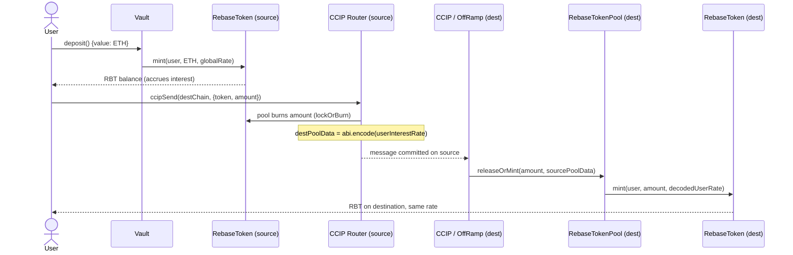

## 1.3 Current strengths

| Strength | Why it matters |
|---|---|
| **Cross-chain *state*, not just value** | Serializing the per-user interest rate into CCIP pool data and reconstructing it on the destination is a genuinely non-trivial design that most bridge tutorials never attempt. |
| **Lazy interest accrual** | No per-block checkpoint storage; interest is computed on read and materialized on write. This is gas-efficient and storage-light. |
| **Monotonic global rate** | The "rate can only decrease" invariant is a deliberate anti-rug tokenomics decision that protects existing depositors' contracted yield. |
| **Role-scoped mint/burn** | `MINT_AND_BURN_ROLE` cleanly separates privileged minters (vault, pool) from the token's ownership. |
| **CEI-respecting redeem** | `Vault.redeem` burns before the external ETH transfer, which mitigates the most obvious reentrancy vector even without a guard. |
| **Real integration tests** | `CCIPLocalSimulatorFork` fork tests exercise the actual CCIP router message-routing path, not a mock. |

## 1.4 Current limitations

These are the gaps that separate an educational project from a production protocol. Each maps to an upgrade section later.

| # | Limitation | Risk class | Addressed in |
|---|---|---|---|
| L1 | **No pause / emergency stop** anywhere (Vault, Token, Pool). | Availability / incident response | §3, §6, §7 |
| L2 | **No reentrancy guard** on Vault; safety depends solely on CEI ordering and a `type(uint256).max` balance read that itself calls `balanceOf`. | Reentrancy | §3, §6 |
| L3 | **Interest is minted but not economically backed.** The vault holds only deposited ETH; accrued interest inflates RBT supply with no corresponding ETH. Full redemption is impossible if everyone redeems. | Solvency / economic | §6, §8 |
| L4 | **CCIP message payload is unversioned** (`abi.encode(userInterestRate)`), a single naked `uint256`. Any future schema change breaks in-flight and cross-version messages. | Upgrade safety / cross-chain | §4 |
| L5 | **No timelock or governance.** `onlyOwner` is a single EOA/multisig with instant, unilateral power over the rate and roles. | Centralization / trust | §7 |
| L6 | **No rate limiting configured** (pool chain updates set `isEnabled: false`). A pool compromise or mint bug can drain unbounded value cross-chain. | Bridge risk | §3, §4 |
| L7 | **No fees, treasury, or protocol revenue.** No sustainability model. | Economic | §8 |
| L8 | **No withdrawal queue / liquidity accounting.** Redemptions assume the vault is externally funded (stated in README). | Liquidity | §6 |
| L9 | **No upgradeability strategy.** Contracts are non-upgradeable; fixing a bug means redeploying and migrating. | Maintainability | §3, §14 |
| L10 | **Interest-rate inheritance on bridge-in is unconditional.** `mint` sets `s_userInterestRate[to] = bridgedRate` every time, which can *raise* a returning user's rate above the destination global rate — an economic inconsistency. | Economic / correctness | §5 |
| L11 | **Observability is minimal.** Few events; no analytics, health, or cross-chain status surface. | Operability | §9 |
| L12 | **CI is shallow** — no coverage gate, no static analysis, and the workflow references a `ci` Foundry profile that isn't defined in `foundry.toml`. | Quality / DevEx | §12 |

## 1.5 Why these upgrades are necessary

The project already demonstrates the *hard idea* (cross-chain yield-bearing state). What it does not yet demonstrate is the **operational maturity** that distinguishes a protocol that can hold real money from one that cannot:

- **Solvency correctness (L3, L8):** A yield token whose yield is unbacked is, economically, a promise the contract cannot keep. Production requires the yield to be sourced from somewhere real (fees, a yield strategy, or an explicit, capped reward reserve) and the accounting to make insolvency *impossible by construction*, not merely *assumed away*.
- **Blast radius control (L1, L2, L6, L9):** Every production DeFi incident post-mortem shares a theme — the team could not stop the bleeding fast enough. Pause switches, rate limits, circuit breakers, and a rehearsed upgrade path convert a catastrophic loss into a contained one.
- **Credible neutrality (L5, L7):** A single owner who can change yield terms and mint roles instantly is a trust assumption no serious counterparty accepts. Timelock + governance make privileged actions *observable and vetoable before they execute*.
- **Cross-chain forward-compatibility (L4, L10):** Bridges are the single most exploited primitive in the industry. Versioned, hashed, replay-resistant messages and monotonic economic invariants are table stakes for anything that mints tokens based on a message from another chain.

The remainder of this document specifies exactly how to close each gap, in an order that keeps the protocol shippable at every step.

---

# SECTION 2 — Protocol Architecture

This section presents the **target** architecture. It is a superset of the current system — every current contract survives; new contracts wrap, gate, or account around them.

## 2.1 Target contract topology

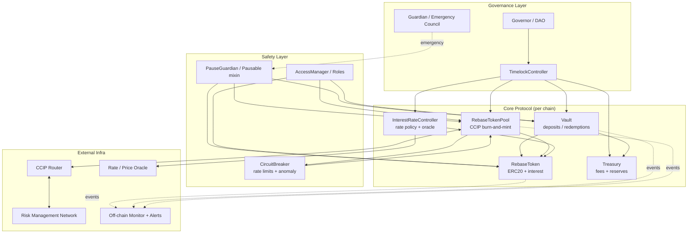

### What is new vs. retained

| Component | Status | Role |
|---|---|---|
| `RebaseToken` | **Retained, extended** | Adds pausability, checkpointed interest index, event enrichment. |
| `Vault` | **Retained, hardened** | Adds reentrancy guard, pause, limits, fee hooks, liquidity accounting, withdrawal queue. |
| `RebaseTokenPool` | **Retained, extended** | Adds message versioning, hashing, replay set, rate-limit enforcement, trusted-remote verification. |
| `InterestRateController` | **New** | Owns rate policy (decay schedule, oracle-driven, bounds). Decouples "who can change the rate" and "how" from the token. |
| `Treasury` | **New** | Custodies protocol fees and the insurance/reserve buffer that backs yield. |
| `CircuitBreaker` | **New** | Global and per-lane throughput limits and anomaly halting. |
| `TimelockController` | **New (OZ)** | Enforces a delay on all privileged parameter changes. |
| `Governor` | **New (OZ)** | On-chain proposal/voting for parameter governance. |
| `Guardian / Emergency Council` | **New** | Multisig that can *pause fast* but not *change value unilaterally*. |
| `AccessManager` / role registry | **New/extended** | Centralizes role assignment; replaces ad-hoc `onlyOwner`. |

**Design principle — separation of powers.** Today `onlyOwner` conflates *value-changing* power (rate, fees) with *safety* power (pause). The target explicitly splits them: the **Timelock+Governor** path is slow and can change economic parameters; the **Guardian** path is fast but can *only* pause/halt, never move funds or change yield terms. This is the single most important architectural change and it structures everything in §3 and §7.

## 2.2 Message flow (deposit → accrue → redeem, single chain)

```mermaid
sequenceDiagram
    actor User
    participant V as Vault
    participant CB as Limits/Pause checks
    participant RBT as RebaseToken
    participant IRC as InterestRateController
    participant T as Treasury

    User->>V: deposit() {ETH}
    V->>CB: check paused? deposit cap? daily limit?
    CB-->>V: ok
    V->>IRC: currentUserRate()
    IRC-->>V: rate (policy-derived)
    V->>RBT: mint(user, netAmount, rate)
    V->>T: route deposit fee (if any)
    RBT-->>User: RBT (accrues per user rate)

    Note over User,RBT: time passes; balanceOf grows lazily

    User->>V: redeem(amount)
    V->>CB: check paused? withdraw cap? liquidity?
    CB-->>V: ok / queue
    V->>RBT: burn(user, amount + accrued)
    V->>T: route performance/withdraw fee
    V-->>User: ETH (amount − fees)
```

## 2.3 CCIP cross-chain flow (versioned, rate-limited, replay-guarded)

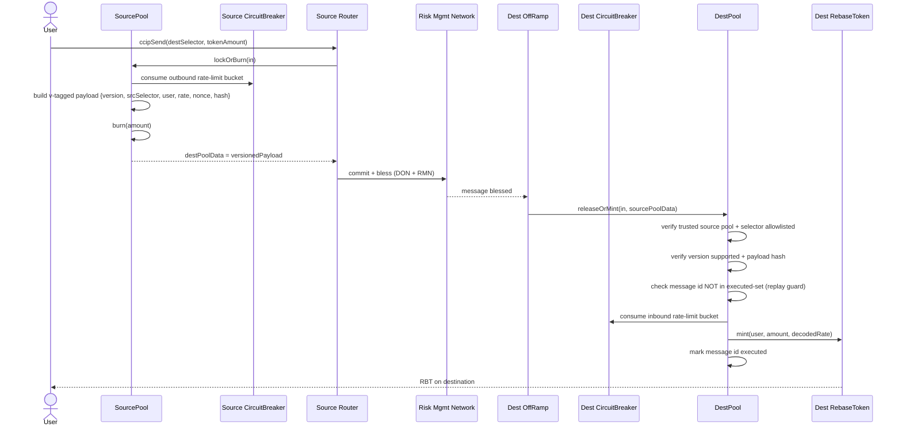

## 2.4 Vault flow (with liquidity, reserve, and queue)

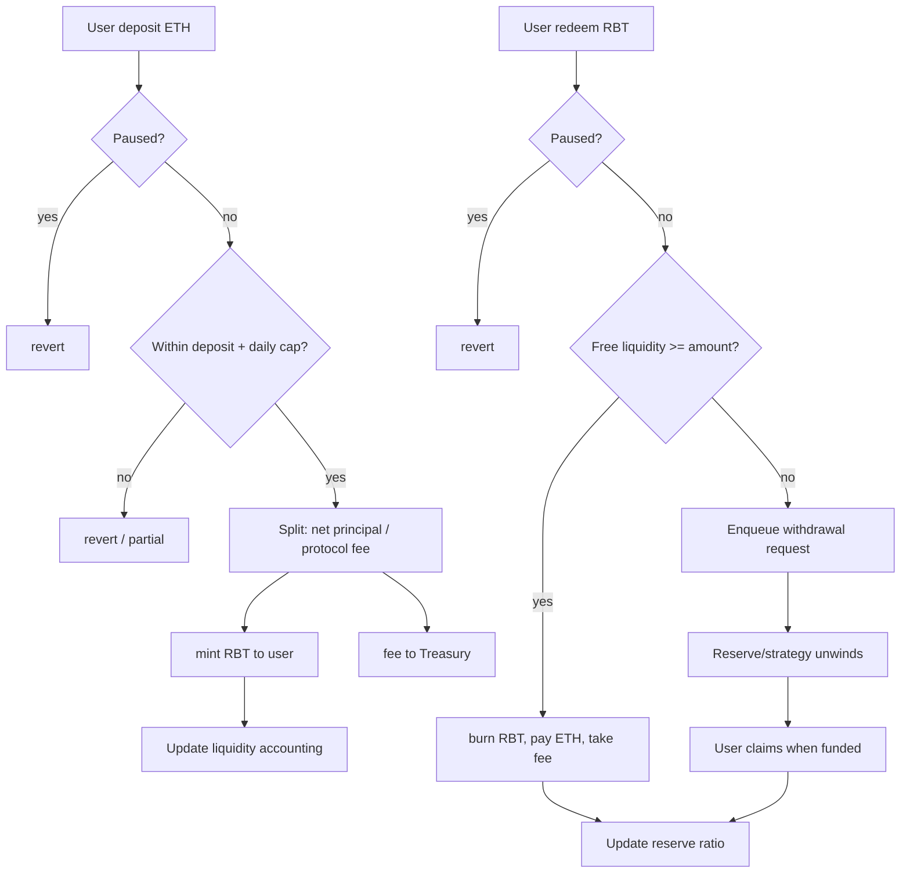

## 2.5 Token flow (value + interest accounting)

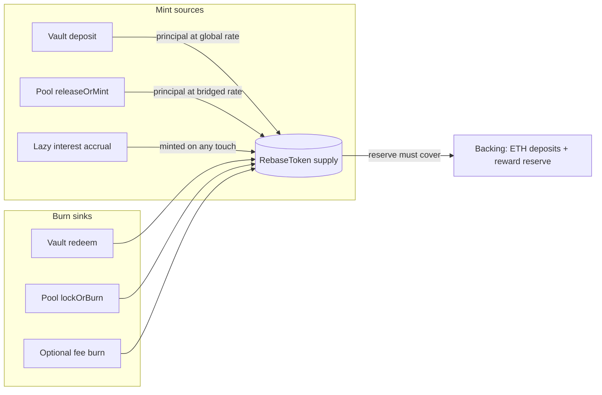

## 2.6 User flow (end-to-end journey)

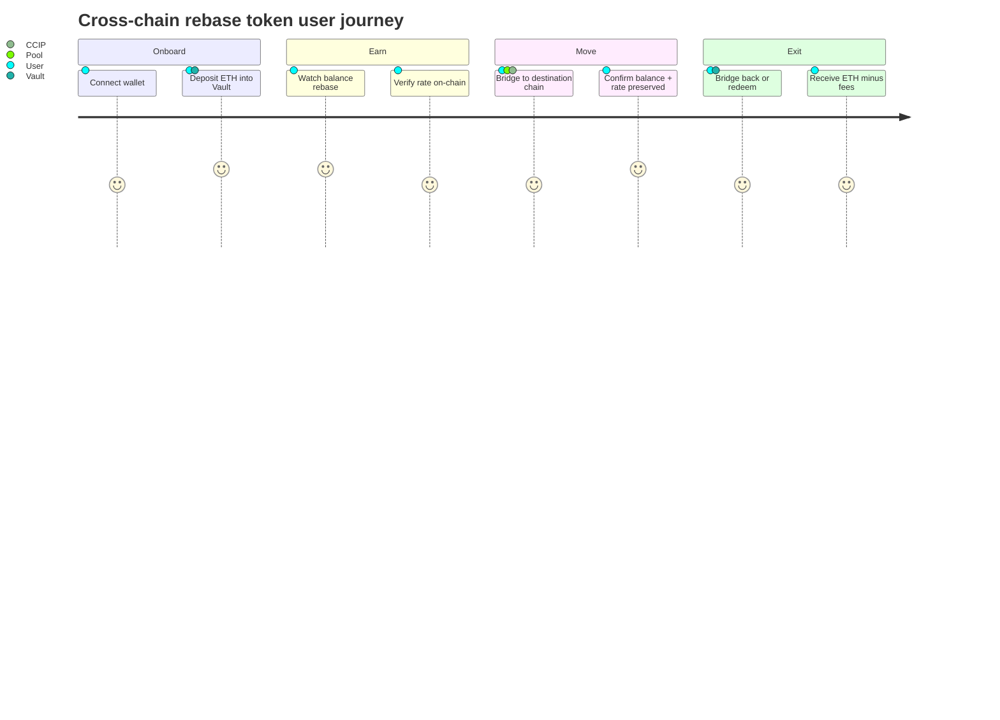

## 2.7 Admin / governance flow

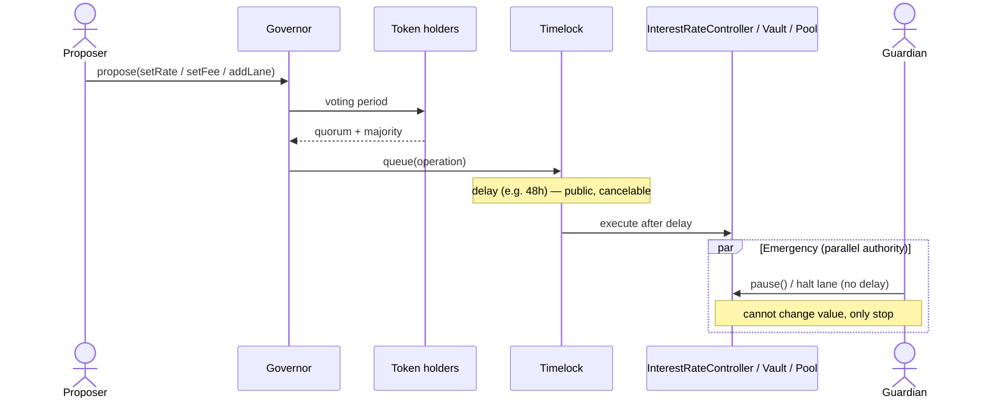

---

# SECTION 3 — Security Improvements

This is the heart of the production upgrade. Each item below states the threat, the current exposure, the recommended control, and the concrete implementation strategy. Controls are ordered roughly by how much blast-radius reduction they provide per unit of effort.

## 3.1 Access control & role management

**`CURRENT`** — `RebaseToken` mixes `Ownable` and `AccessControl`. `onlyOwner` grants `MINT_AND_BURN_ROLE`, sets the rate, and there is no admin for the roles beyond the deployer. `Vault` and `Pool` have no role system of their own beyond CCIP's.

**`UPGRADE`** — Adopt a single, explicit role taxonomy managed centrally (OpenZeppelin `AccessControl` with a dedicated `DEFAULT_ADMIN_ROLE` held by the Timelock, or `AccessManager` for OZ v5 delayed-role semantics).

| Role | Holder (recommended) | Powers |
|---|---|---|
| `DEFAULT_ADMIN_ROLE` | Timelock | Grants/revokes all other roles |
| `MINT_AND_BURN_ROLE` | Vault, Pool | Mint/burn RBT |
| `RATE_ADMIN_ROLE` | InterestRateController (itself governed) | Move the global rate within policy |
| `PAUSER_ROLE` | Guardian multisig | Pause, never unpause without governance |
| `UNPAUSER_ROLE` | Timelock | Resume operations |
| `FEE_ADMIN_ROLE` | Timelock | Adjust fees within bounds |
| `LANE_ADMIN_ROLE` | Timelock | Add/remove CCIP lanes, set rate limits |
| `TREASURER_ROLE` | Timelock / Treasury | Move reserve funds within policy |

**Implementation strategy:**
1. Remove `Ownable` from the trust-critical path; keep it only if a library requires it, and point its owner at the Timelock.
2. Transfer `DEFAULT_ADMIN_ROLE` to the Timelock at deployment; **renounce the deployer's admin** in the same deploy script (and test that renouncement).
3. Introduce a two-step admin handover (`grant → accept`) so a fat-fingered address cannot brick the protocol.
4. Emit a `RoleGranted`/`RoleRevoked` audit trail (AccessControl already does) and index it in monitoring (§9).

**Trade-off:** More roles = more surface to reason about, but each role is *least-privilege*, so a single compromised key can do strictly less. The alternative (one omnipotent owner) is simpler but is exactly the pattern behind most "admin key drained the protocol" incidents.

## 3.2 Emergency pause

**`CURRENT`** — None. If a bug is found, there is no way to stop deposits, redemptions, or bridging while a fix is prepared.

**`UPGRADE`** — Add OpenZeppelin `Pausable` to `Vault`, `RebaseToken` (at least mint/transfer paths that matter), and `RebaseTokenPool`. Wire `whenNotPaused` to the state-changing entrypoints.

**Design nuance — asymmetric pause authority:**
- **Pausing** is fast and cheap: any `PAUSER_ROLE` holder (Guardian multisig with a low threshold, e.g., 2-of-5) can pause instantly. Speed matters more than deliberation during an incident.
- **Unpausing** requires the slow path (Timelock/governance or a higher multisig threshold). This prevents an attacker who compromises one guardian key from *un*pausing to resume an exploit.

**Granularity:** Prefer *scoped* pauses over one global kill-switch:

| Pause scope | Stops | Leaves working |
|---|---|---|
| `pauseDeposits` | New deposits | Redemptions, transfers |
| `pauseRedemptions` | Withdrawals | Deposits (rare, but useful during reserve rebalancing) |
| `pauseBridgeOut` | `lockOrBurn` | Local operations |
| `pauseBridgeIn` | `releaseOrMint` | Everything else |
| `pauseAll` | Everything | Nothing |

**Interaction:** Pause checks must be *before* any state mutation and before external calls. The Guardian's pause authority is the emergency counterpart to the Timelock's governance authority in §2.7.

**Trade-off:** Pausing redemptions is a trust hazard (users hate being locked out of their funds) — mitigate by (a) making pause events loudly observable, (b) requiring governance to *extend* a pause beyond a max duration, and (c) documenting pause conditions in advance.

## 3.3 Reentrancy protection

**`CURRENT`** — `Vault.redeem` follows CEI (burns before the external ETH `call`), which is good, but there is no `nonReentrant` guard. The `type(uint256).max` branch reads `balanceOf` (which itself does no external call, so it's safe today), but any future addition of a hook, callback, or ERC-777-style token would reintroduce risk.

**`UPGRADE`** — Add OpenZeppelin `ReentrancyGuard` (or the transient-storage `ReentrancyGuardTransient` on post-Cancun chains for cheaper guards) to:
- `Vault.deposit` and `Vault.redeem`
- Any future `claimWithdrawal` (queue) function
- Pool entrypoints that make external calls

**Defense in depth, not either/or:** Keep CEI ordering *and* add the guard. CEI prevents the classic single-function reentrancy; the guard prevents cross-function reentrancy (e.g., re-entering `deposit` from within a `redeem` callback) which CEI alone does not.

**Interaction with pause:** Order the modifiers deliberately — `whenNotPaused` then `nonReentrant`. The reentrancy guard should wrap the entire body including the pause check so a reentrant call can't slip in during a state transition.

**Trade-off:** The guard costs ~2,900 gas (SSTORE) on non-transient chains. `ReentrancyGuardTransient` reduces this dramatically. For a vault handling real ETH, this cost is negligible relative to the risk removed.

## 3.4 Rate limiting

**`CURRENT`** — `configureTokenPool` in tests sets `outboundRateLimiterConfig` and `inboundRateLimiterConfig` to `{isEnabled: false, capacity: 0, rate: 0}`. Bridging is effectively *unbounded*.

**`UPGRADE`** — Enable CCIP's built-in token-bucket rate limiter per lane, and add a protocol-level aggregate limiter (see §3.6 circuit breaker).

**CCIP token-bucket parameters:**

| Parameter | Meaning | Recommended starting point |
|---|---|---|
| `capacity` | Max tokens that can move in a burst | e.g., 5% of circulating supply per lane |
| `rate` | Refill per second (sustained throughput) | capacity / target-refill-window (e.g., over 4h) |
| `isEnabled` | Toggle | `true` on all production lanes |

**Implementation strategy:**
1. Set conservative limits at launch; raise them via governance as confidence and TVL grow.
2. Configure *both* inbound and outbound — an inbound-only limit lets an attacker drain the source; outbound-only lets them flood the destination.
3. Surface remaining bucket capacity as a read function for the front end and monitor (§9).

**Trade-off:** Tight limits degrade UX for large legitimate transfers (they get throttled or must split). This is an acceptable cost — every major bridge hack (Ronin, Wormhole, Nomad) moved hundreds of millions in a single burst that a rate limiter would have capped. Rate limits convert "total loss" into "capped loss + time to respond."

## 3.5 Chain validation & trusted remote verification

**`CURRENT`** — The pool relies on CCIP's `_validateLockOrBurn` / `_validateReleaseOrMint` and the chain-update allowlist. There is no *additional* protocol-level assertion that the decoded sender/rate came from a pool the protocol itself trusts, beyond CCIP's own checks.

**`UPGRADE`** — Layer explicit trusted-remote checks on top of CCIP:

1. **Chain selector allowlist:** Maintain a `mapping(uint64 => bool) supportedChains` (governance-managed). Reject any `remoteChainSelector` not explicitly enabled, even if CCIP would route it.
2. **Trusted pool registry:** Store the expected remote pool address per selector and assert the message's source pool matches. CCIP's `applyChainUpdates` already records remote pools; the upgrade is to *fail loudly and log* on mismatch rather than trust silently.
3. **Trusted token registry:** Assert the remote token address maps to the expected canonical RBT deployment per chain.

**Interaction:** These checks live in `releaseOrMint` *before* the mint, and in `lockOrBurn` *before* the burn, forming a whitelist gate around CCIP's own validation.

**Trade-off:** Redundant with CCIP's guarantees in the happy path, but bridges fail at integration seams. Redundant validation is cheap insurance against a CCIP misconfiguration or an unforeseen router behavior.

## 3.6 Circuit breaker

**`CURRENT`** — None.

**`UPGRADE`** — A dedicated `CircuitBreaker` contract (or mixin) that monitors *aggregate* flow across all lanes and trips automatically on anomalies, independent of per-lane CCIP rate limits.

**What it watches:**

| Signal | Trip condition (example) | Action |
|---|---|---|
| Net outflow velocity | > X% of TVL bridged/redeemed in T minutes | Auto-pause bridge + redemptions |
| Mint/burn imbalance | Cross-chain minted − burned diverges beyond ε | Halt inbound mint |
| Reserve ratio | Backing / liabilities < floor | Pause deposits or throttle yield |
| Single-tx size | > cap | Reject or queue |

**Implementation strategy:**
1. Maintain rolling counters (windowed) of value in/out. Use time-bucketed accumulators to avoid unbounded storage.
2. On trip, call the same pause entrypoints the Guardian uses — the breaker is an *automated pauser*.
3. Provide a governance-only reset with a cooldown so the breaker can't be spammed on/off.

**Trade-off:** False positives can halt a healthy protocol during legitimate high-volume periods. Tune thresholds generously at first and tighten with data. The asymmetry favors caution — an unnecessary pause costs UX; a missed anomaly costs the treasury.

## 3.7 Cross-chain replay & duplicate message execution

**`CURRENT`** — Replay protection is *entirely* delegated to CCIP (each message has a unique `messageId` and the OffRamp executes each once). The protocol keeps no independent record.

**`UPGRADE`** — Add a **protocol-level executed-message set** as defense in depth:

1. Store `mapping(bytes32 => bool) executedMessages` keyed by the CCIP `messageId` (or a hash of the full versioned payload).
2. In `releaseOrMint`, `require(!executed[id])`, then set it — *before* minting.
3. Emit `MessageExecuted(id, srcSelector, receiver, amount)`.

**Why duplicate the CCIP guarantee?** Two reasons: (a) if a future migration reuses the pool with a different router, the local set still protects you; (b) it makes the invariant *provable in your own tests* ("no messageId mints twice") rather than assumed from a dependency.

**Bridge replay across versions:** When you version payloads (§4), include a `nonce` and `sourceChainSelector` inside the *hashed* payload so a message valid on lane A→B can never be replayed on lane A→C.

**Trade-off:** One extra SSTORE per inbound message (~20k gas cold). Acceptable for the assurance; the set grows unbounded, so consider pruning old epochs or accepting the storage cost as the price of an immutable audit trail.

## 3.8 Nonce management

**`CURRENT`** — None at the protocol layer; CCIP sequences messages per lane internally.

**`UPGRADE`** — Introduce an explicit per-(sender, sourceChain) nonce embedded in the versioned payload for *idempotency and ordering assertions you control*:

- On `lockOrBurn`, increment and include `nonce`.
- On `releaseOrMint`, record the highest processed nonce per lane; reject stale or duplicate nonces.
- This is primarily for **auditability and future message types** (e.g., cross-chain governance in §13) where you may send non-token messages that CCIP's token-transfer replay guard doesn't cover.

**Trade-off:** Strict monotonic nonce enforcement can *stall a lane* if one message is stuck (head-of-line blocking). For token transfers, prefer a *set-based* replay guard (§3.7) over strict ordering; reserve strict nonces for control-plane messages where ordering genuinely matters. Make this an explicit, documented choice.

## 3.9 Cross-chain spoofing & signature validation

**`CURRENT`** — Trust is rooted in CCIP's router + Risk Management Network (RMN). No app-level signatures.

**`UPGRADE`** —
1. **Rely on CCIP + RMN as the primary trust root** (correct and idiomatic — don't reinvent consensus).
2. **Add app-level assertions** that the `msg.sender` of `releaseOrMint` is the canonical OffRamp/router for that chain, and that the source pool is the registered trusted remote (§3.5).
3. **For any future off-chain-signed actions** (e.g., permit-style gasless deposits, meta-transactions), use EIP-712 typed-data signatures with a domain separator that includes `chainId` and the verifying contract, plus a nonce, to bind each signature to one chain and one use.

**Trade-off:** App-level signatures add flexibility (gasless UX) at the cost of a new, security-critical verification path. Only add them when the UX benefit is real; each signing scheme is an audit item.

## 3.10 Front-running & sandwich attacks

**`CURRENT`** — Deposit/redeem are 1:1 with ETH and interest is time-based, so classic AMM sandwiching doesn't directly apply. But two MEV surfaces exist:
- `setInterestRate` is public-mempool observable; searchers can deposit *just before* a rate decrease to lock the higher rate.
- If a yield strategy is added (§6/§8), redemption pricing could become sandwichable.

**`UPGRADE`** —
1. **Rate changes via Timelock** (§7) make the *direction and timing public in advance* — this is intentional and fair (everyone sees it), converting a hidden front-run into a transparent, equal-opportunity window.
2. **For strategy-backed redemptions:** add slippage/`minOut` parameters and, if using an oracle, sanity-band checks against manipulation.
3. **Commit-reveal** for any auction-like or first-come mechanics if they're ever added.
4. Consider a **short deposit→bridge or deposit→redeem cooldown** to blunt rate-arbitrage sniping around scheduled rate changes.

**Trade-off:** Cooldowns hurt UX and composability. The monotonic-decreasing-rate design already limits the upside of front-running (you can only ever lock a *higher* rate, and only briefly), so heavy anti-MEV machinery is likely overkill here — document the reasoning rather than over-engineering.

## 3.11 DoS prevention

**`CURRENT`** — Potential vectors: unbounded loops (none currently), griefing the withdrawal path, and the redeem `call` to arbitrary `msg.sender` (a contract that reverts on receive can only DoS *itself*, which is fine).

**`UPGRADE`** —
1. **No unbounded iteration** over user sets or message lists in any state-changing function. The withdrawal queue (§6) must be claimable *per-user* (pull), never processed in a loop (push).
2. **Pull-over-push** for all value transfers — users claim; the protocol never iterates payouts.
3. **Gas-bounded external calls** — cap gas forwarded on the redeem `call`, or use a pull pattern for ETH too.
4. **Griefing resistance** on the replay/nonce sets — key by `messageId`, not by attacker-controllable data that could bloat storage cheaply.

**Trade-off:** Pull patterns add a second transaction for users (claim step) but are the canonical defense against payout-loop DoS. Adopt them anywhere batch payout is conceivable.

## 3.12 Bridge replay attacks (deep dive)

Consolidating the cross-chain replay defenses into one coherent model:

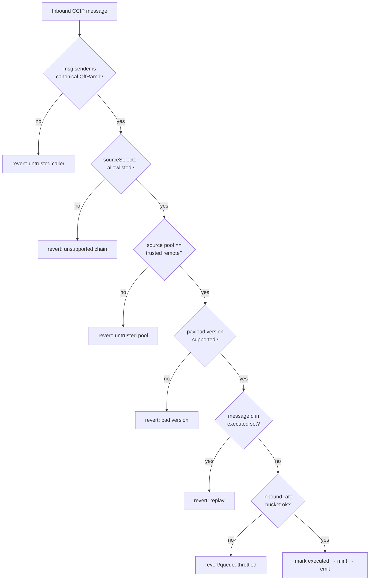

Each gate is independently sufficient to stop a whole class of attack; together they are the "many locks on one door" pattern auditors expect.

## 3.13 Timelock

**`CURRENT`** — None. Owner actions are instant.

**`UPGRADE`** — Route all *value-affecting* privileged actions through an OpenZeppelin `TimelockController` with a delay (e.g., 24–72h):

- Rate policy changes, fee changes, new lanes, reserve movements, upgrades.
- The Timelock is the `DEFAULT_ADMIN_ROLE` holder and the target of the Governor.
- Emergency pauses bypass the Timelock via the Guardian path (§3.2) — the delay applies to *changing value*, never to *stopping the bleeding*.

**Trade-off:** A delay means you cannot instantly fix a *parameter*-based problem (e.g., an obviously-wrong fee) — but you can always *pause*, then fix through the delayed path. The transparency and vetoability are worth the latency. Set the delay long enough for users to exit if they disagree, short enough to respond to non-emergencies.

## 3.14 Upgrade safety & storage collision

**`CURRENT`** — Contracts are non-upgradeable. Fixing a bug = redeploy + migrate roles + re-register with CCIP + migrate liquidity. That's slow and error-prone but has the virtue of *immutability* (no proxy admin key risk).

**`UPGRADE` — choose one path deliberately:**

| Path | Pros | Cons | Recommendation |
|---|---|---|---|
| **Stay immutable + migration playbook** | No proxy admin key; simplest trust story | Slow bug response; liquidity migration risk | Good for the *token* (immutability is a feature for money) |
| **UUPS proxy (per-contract upgrade in the impl)** | Upgradeable; admin logic in impl | Storage-layout discipline required; upgrade key is a target | Good for *Vault*, *Controller*, *Treasury* |
| **Transparent proxy** | Clear admin/impl split | Slightly higher gas; separate ProxyAdmin | Alternative to UUPS |
| **Diamond (EIP-2535)** | Modular, granular upgrades | Complexity, tooling, audit surface | Overkill here |

**Recommended split:** Keep `RebaseToken` **immutable** (money should be hard to change) but make `Vault`, `InterestRateController`, and `Treasury` **UUPS-upgradeable** behind the Timelock. This gives you agility where logic evolves and immutability where trust is paramount.

**Storage collision rules (mandatory if using proxies):**
1. Use **namespaced storage** (ERC-7201) or append-only storage layouts — never reorder or remove existing variables.
2. Reserve **storage gaps** (`uint256[N] __gap`) in every upgradeable base contract.
3. Run **`forge inspect storage-layout`** diffs in CI on every change; fail the build if an existing slot moves.
4. Never change a variable's type in a way that changes its slot packing.
5. Initialize via `initializer` (not constructor) and guard against re-initialization; disable initializers on the implementation.

**Trade-off:** Upgradeability introduces the single most dangerous key in DeFi (the upgrade admin). Mitigate by (a) Timelock-gating upgrades, (b) requiring governance approval, and (c) publishing the new implementation's diff during the timelock window.

## 3.15 Trusted router & pool verification

**`CURRENT`** — CCIP's `TokenPool` base already validates the router; the protocol adds nothing.

**`UPGRADE`** —
1. Store the expected `router` and `rmnProxy` as immutables (they already are, via the constructor) and *assert* against them in every privileged entrypoint.
2. Add a governance function to rotate the router *only through the Timelock* (CCIP occasionally upgrades routers) — never an instant swap.
3. On `releaseOrMint`, verify the calling OffRamp is registered by the current router (`isOffRamp` pattern) — do not trust an arbitrary caller claiming to be CCIP.

**Trade-off:** Hard-pinning the router is safest but breaks if CCIP upgrades; a Timelock-gated rotation balances safety and maintainability.

## 3.16 Failure recovery, emergency withdrawal & recovery mode

**`CURRENT`** — None. A stuck or failed cross-chain message has no protocol-level recovery; funds burned on the source with a failed mint on the destination would be lost (in practice CCIP's manual execution mitigates this, but the protocol offers nothing itself).

**`UPGRADE`** — Three layered mechanisms:

1. **CCIP manual execution support:** Document and tool the CCIP manual re-execution path for messages that fail on the destination. Provide a script and a monitor alert (§9).
2. **Failed-message retry & recovery (app level):** For the *control plane* (non-token messages), store failed messages and expose a permissioned `retry(messageId)`; for *token* messages, lean on CCIP's guarantees plus a `recordFailedMint` event so ops can act.
3. **Recovery mode:** A governance-triggered state where the protocol only allows *redemptions* (no deposits, no bridging), used to wind down safely after a critical bug. In recovery mode, redemptions may be served pro-rata against available reserves if the protocol is undercollateralized (see §8).

**Emergency withdrawal:** A guarded `sweep`/`rescue` for *non-protocol* tokens accidentally sent to contracts — must **exclude** the protocol's own accounting assets (RBT, backing ETH) so it can never be used to rug users. Gate it behind the Timelock and emit a loud event.

**Trade-off:** Any "admin can move funds" function is a rug vector. The mitigation is strict scoping (only foreign tokens), Timelock gating, and explicit exclusion lists tested with invariants ("rescue can never reduce backing below liabilities").

## 3.17 Monitoring & logging (security lens)

Covered fully in §9, but from the security angle the requirement is: **every privileged action, every cross-chain message, every pause, every limit breach, and every role change must emit a structured, indexed event** so off-chain monitors can detect anomalies in real time and page a human. Security without observability is security you cannot operate.

## 3.18 Security controls summary

| Control | Contract(s) touched | New/OZ dependency | Blast-radius reduction |
|---|---|---|---|
| Role taxonomy | All | `AccessControl` / `AccessManager` | High |
| Emergency pause | Vault, Token, Pool | `Pausable` | Very high |
| Reentrancy guard | Vault, Pool | `ReentrancyGuard(Transient)` | High |
| Rate limiting | Pool | CCIP built-in | Very high |
| Circuit breaker | New `CircuitBreaker` | Custom | Very high |
| Trusted-remote checks | Pool | Custom | High |
| Replay set | Pool | Custom | High |
| Timelock | Governance | `TimelockController` | High |
| Upgrade discipline | Vault/Controller/Treasury | UUPS + ERC-7201 | Medium |
| Recovery mode | Vault, Governance | Custom | Medium |

---

# SECTION 4 — Cross-Chain Improvements

The bridge is the highest-value, highest-risk surface. The goal here is to evolve from "encode a bare `uint256` and hope the schema never changes" to a **versioned, hashed, replay-resistant, observable, multi-chain message protocol** with a clear extensibility story.

## 4.1 The core problem with the current payload

**`CURRENT`** — `lockOrBurn` returns `destPoolData = abi.encode(userInterestRate)` — a single naked `uint256`. `releaseOrMint` does `abi.decode(sourcePoolData, (uint256))`.

Failure modes:
- **No version field:** the moment you need to send a second value (e.g., a nonce, a checkpoint index, a fee tier), old and new pools become mutually incompatible with no negotiation path. In-flight messages during an upgrade could be misdecoded.
- **No integrity binding:** the payload isn't bound to the sender, source chain, or amount inside the protocol's own logic — you trust CCIP entirely.
- **No forward room:** adding fields later is a breaking change.

## 4.2 Message versioning

**`UPGRADE`** — Define a self-describing payload with a leading version byte/word and a typed struct per version.

Conceptual layout (encoded, not Solidity):

| Field | Type | Purpose |
|---|---|---|
| `version` | `uint8`/`uint16` | Schema selector; enables backward-compatible decoding |
| `msgType` | `uint8` | `TOKEN_TRANSFER`, later `GOVERNANCE`, `RATE_SYNC`, etc. |
| `sourceChainSelector` | `uint64` | Binds payload to its origin lane |
| `sender` | `address`/`bytes` | Original user (already available via CCIP, duplicated for app-level assertion) |
| `userInterestRate` | `uint256` | The preserved yield term (today's only field) |
| `nonce` | `uint256` | App-level idempotency/ordering |
| `payloadHash` | `bytes32` | keccak256 of the canonical fields for integrity |

**Decoding strategy:** Read `version` first, then dispatch to the matching decoder. Maintain a `mapping(uint16 => bool) supportedVersions` so governance can enable a new version on all chains *before* senders start emitting it, and later sunset old ones.

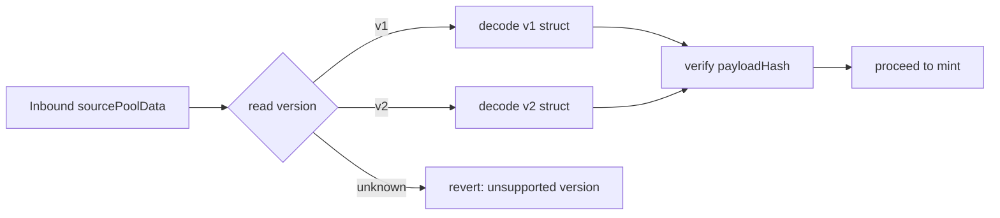

**Rollout discipline (critical):** Because messages are asynchronous, a new version must be **decodable by the destination before the source starts sending it**. The sequence is: (1) deploy dest support for vN, (2) enable vN in dest `supportedVersions`, (3) only then enable vN emission on the source. Reverse the order to remove a version.

**Trade-off:** Versioning adds encoding/decoding complexity and a few bytes of CCIP payload cost. This is trivially worth it — unversioned wire formats are a top source of cross-chain bugs, and the cost of *not* having versioning is a hard fork of the bridge.

## 4.3 Message hashing & metadata encoding

**`UPGRADE`** —
1. **Canonical hashing:** Compute `payloadHash = keccak256(abi.encode(version, msgType, sourceChainSelector, sender, amount, userInterestRate, nonce))` on the source and re-derive + compare on the destination. This binds every field together so no single value can be tampered independent of the others.
2. **Metadata encoding conventions:** Standardize on `abi.encode` (not `encodePacked`) for anything hashed, to avoid hash-collision ambiguity from packed dynamic types.
3. **Amount binding:** Include the amount in the hash so a message can't be replayed with a different amount even if some field were malleable.

**Interaction with §3.7 replay set:** The `payloadHash` (or CCIP `messageId`) is the key for the executed-messages set. Same value serves integrity and replay defense.

**Trade-off:** Hashing costs gas but is cheap relative to the mint it guards. It also gives you a single 32-byte handle to log, index, and reference in support tooling.

## 4.4 Cross-chain acknowledgements

**`CURRENT`** — Fire-and-forget. The source never learns whether the destination mint succeeded.

**`UPGRADE`** — Add an **acknowledgement (ACK) channel** for message types that need delivery confirmation (primarily the future control plane; token transfers can rely on CCIP finality + monitoring).

Design:
- Destination, upon successful `releaseOrMint` of an ACK-requiring message, sends a lightweight ACK message back to the source pool referencing the original `payloadHash`.
- Source maintains `mapping(bytes32 => Status) messageStatus` with `PENDING → CONFIRMED / FAILED`.
- ACKs are themselves versioned messages (`msgType = ACK`).

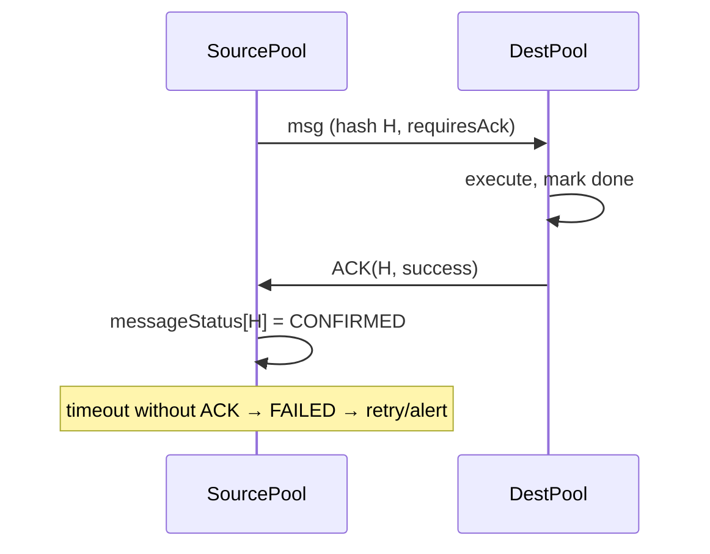

**Trade-off:** ACKs double the message count and cost for confirmed flows, so apply them selectively (governance/state-sync, not every token transfer). They are essential for any *stateful* cross-chain action where the source must know the outcome.

## 4.5 Failed message retry & queue management

**`UPGRADE`** —
1. **Token transfers:** rely on CCIP's manual execution for messages that fail on the destination (e.g., gas underestimate). Provide operator tooling + an alert, and an event `MintFailed(messageId, receiver, amount, reason)`.
2. **Control-plane messages:** persist failed inbound messages in a `failedMessages` store keyed by hash; expose a permissioned `retry(hash)` that re-attempts execution. Cap retries and emit on exhaustion.
3. **Queue management:** model the retry store as a bounded, per-message pull structure (no unbounded loops). Governance can `expire(hash)` messages that are permanently dead to reclaim storage.

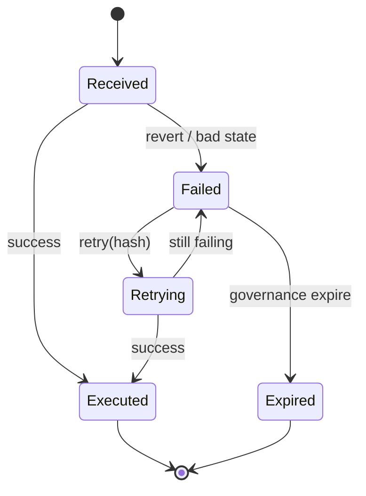

**Trade-off:** A retry store adds storage and an admin surface. Bound it strictly and prefer CCIP's native mechanisms for token flows; reserve app-level retry for messages CCIP can't re-drive semantically.

## 4.6 Multi-chain support & extensibility

**`CURRENT`** — Two chains (Sepolia, Arbitrum Sepolia) via fork tests; one live (Sepolia). Adding a chain means manual pool deploy + `applyChainUpdates` + registry steps.

**`UPGRADE`** — Make multi-chain a first-class, config-driven capability:

1. **Lane registry:** A `mapping(uint64 selector => LaneConfig)` holding remote pool, remote token, rate-limit config, supported versions, and an `enabled` flag — all governance-managed.
2. **Idempotent lane onboarding script:** One parameterized deploy/config script per new chain, driven by a JSON/TOML chain-config file (selectors, routers, RMN proxies), so adding chain N is a data change, not a code change.
3. **Topology:** Support a **hub-and-spoke** *or* **mesh** topology explicitly. Mesh (every chain talks to every chain) is `O(n²)` lanes; hub-and-spoke routes through a canonical chain and is `O(n)` to configure but adds a hop. Document the choice.

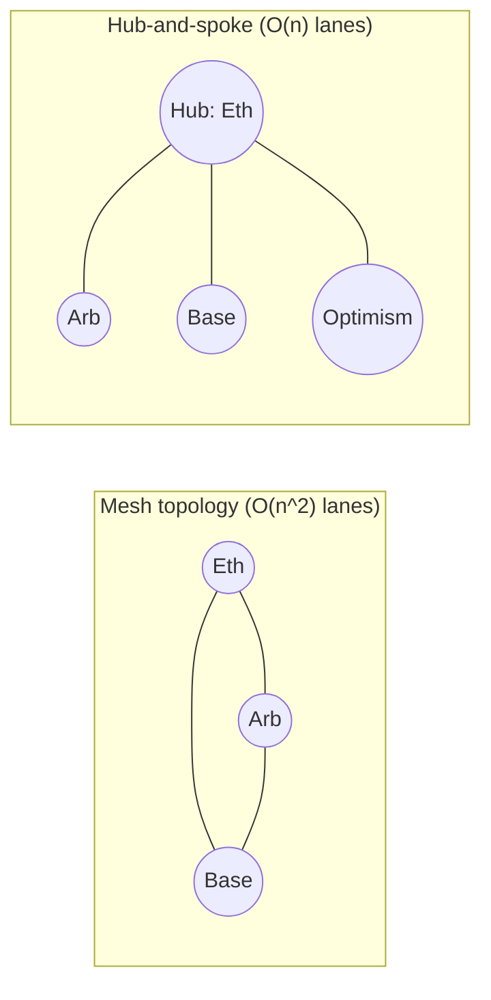

**Trade-off:** Mesh gives direct lanes (better UX, no double-bridging) but explodes configuration and rate-limit surface. Hub-and-spoke simplifies governance and monitoring but concentrates risk and adds latency/cost for spoke-to-spoke transfers. For ≤4 chains, mesh is fine; beyond that, hub-and-spoke's operational simplicity usually wins.

## 4.7 Cross-chain state synchronization

**`CURRENT`** — The only synced state is the per-user interest rate, carried inside each token transfer. The *global* rate is set independently per chain and can drift.

**`UPGRADE`** — Introduce a deliberate state-sync model:

| State | Sync strategy | Rationale |
|---|---|---|
| Per-user rate | In-band with token transfer (as today) | Naturally travels with the user's tokens |
| Global interest rate | Out-of-band `RATE_SYNC` control message from a canonical source | One authoritative rate, propagated; avoids drift and the L10 inconsistency |
| Total supply / liabilities | Periodic reporting to a canonical aggregator for solvency checks | Enables global reserve-ratio invariants |
| Pause state | Broadcast `HALT` control message | One-click global halt during incidents |

**Canonical-chain pattern:** Designate one chain (e.g., Ethereum) as the source of truth for the global rate and pause state. Other chains *receive* rate/pause updates via versioned control messages and cannot set them locally (except emergency local pause). This resolves L10: a returning bridger's rate is reconciled against a single global rate rather than being blindly inherited.

**Trade-off:** Canonical-chain sync introduces a dependency (if the hub is down, updates stall) and latency (propagation delay). The alternative — independent per-chain rates — is simpler but allows arbitrage and inconsistent user experience. For a yield token where the rate is the product, one authoritative rate is worth the coupling.

## 4.8 Bridge analytics & events

**`UPGRADE`** — Emit a rich, indexed event on every cross-chain action so the bridge is fully observable (feeds §9):

| Event | Emitted at | Indexed fields |
|---|---|---|
| `BridgeInitiated` | `lockOrBurn` | user, destSelector, amount, rate, payloadHash, nonce |
| `BridgeCompleted` | `releaseOrMint` | user, srcSelector, amount, rate, payloadHash |
| `MessageExecuted` | replay-set write | messageId/hash |
| `MintFailed` | failed dest mint | messageId, receiver, amount, reason |
| `RateLimitConsumed` | on throttle | selector, remaining capacity |
| `LaneConfigured` | `applyChainUpdates` | selector, remotePool, remoteToken |
| `AckReceived` | ACK inbound | payloadHash, success |

**Analytics surface:** From these events, an indexer (§9) can compute: total value bridged per lane, per-lane latency (initiated→completed), failure rate, rate-limit utilization, and net cross-chain supply imbalance (a solvency signal).

**Trade-off:** More events = marginally higher gas. This is the cheapest, highest-leverage observability investment in the whole protocol — do not skimp.

## 4.9 Cross-chain improvements summary

| Improvement | Priority | Depends on |
|---|---|---|
| Message versioning | P0 | — |
| Payload hashing | P0 | versioning |
| Replay set | P0 | hashing |
| Rate-limit enable | P0 | lane registry |
| Trusted-remote checks | P0 | lane registry |
| Bridge events/analytics | P1 | — |
| Lane registry + onboarding script | P1 | versioning |
| ACK channel | P2 | versioning, msgType |
| Failed-message retry/queue | P2 | ACK |
| Global rate sync (canonical chain) | P2 | versioning, governance |

---

# SECTION 5 — Interest System Improvements

The interest model is the protocol's intellectual core. The upgrades here make it *precise, auditable, and future-proof* without abandoning the elegant lazy-accrual idea.

## 5.1 How interest works today (precise restatement)

**`CURRENT`** —
- `balanceOf(u) = principal(u) × (PRECISION_FACTOR + userRate × Δt) / PRECISION_FACTOR`, `Δt = now − lastUpdated(u)`.
- `_mintAccruedInterest(u)` mints `balanceOf(u) − principal(u)` and sets `lastUpdated(u) = now`, folding accrued interest into principal.
- Consequences:
  - Growth is **piecewise-linear, stepwise-compounding**: within an interval it's linear; at each touch the accrued interest is capitalized into principal, so the *next* interval's linear growth is computed on a larger base. Frequent touches → more compounding; rare touches → less. **Balance is therefore path-dependent on interaction frequency** — a subtle correctness/fairness property most users won't expect.
  - `userRate` is per-user and set at first receipt.
  - The global rate only decreases.

## 5.2 Interest snapshots & checkpoints

**`UPGRADE`** — Introduce an explicit **checkpoint** concept so accrual is deterministic and auditable:

1. Store, per user, a `Checkpoint { principal, rate, timestamp, index }` rather than three loosely-coupled mappings. This groups the state that must move together and prevents partial-update bugs.
2. On every accrual, write a new checkpoint and emit `InterestAccrued(user, from, to, amount, newPrincipal)` so the entire accrual history is reconstructable off-chain.
3. Optionally retain a bounded ring buffer of recent checkpoints per user for dispute resolution / analytics, or (cheaper) rely purely on emitted events for history.

**Trade-off:** Grouping into a struct is cleaner and less bug-prone but may change storage packing (plan the layout; see gas §11). Full on-chain history is expensive — prefer event-sourced history with only the *latest* checkpoint on-chain.

## 5.3 Global interest index (the big architectural option)

**`UPGRADE` (recommended for precision):** Replace (or complement) per-user linear accrual with a **global rebase index**, the model used by Aave aTokens / Compound / stETH:

- Maintain a single monotonically increasing `globalIndex` that accrues at the global rate.
- Store each user's balance as **shares**; `balanceOf = shares × globalIndex`.
- Interest is then *automatically and uniformly* reflected in everyone's balance with **no per-user touch required** and **no path dependence**.

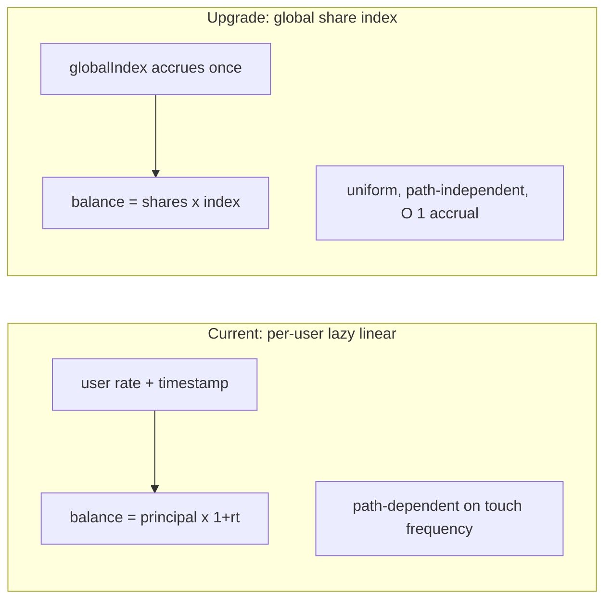

**But there is a conflict:** the current design's *selling point* is **per-user rates preserved across chains**. A single global index assumes one rate for everyone. Two ways to reconcile:

| Approach | Description | Trade-off |
|---|---|---|
| **A. Single global index** | One rate for all; drop per-user rates | Simpler, precise, gas-cheap; but loses the differentiated-rate feature that makes this project distinctive |
| **B. Bucketed indices** | One index *per distinct rate tier*; users hold shares in their tier's index | Preserves per-user rates *and* gains index precision; more complex, must bound the number of tiers |
| **C. Keep per-user linear, add checkpoints** | Minimal change; formalize current model | Least disruptive; retains path-dependence |

**Recommendation:** If differentiated per-user rates are the headline feature (they are, for this project's identity and interview story), pursue **B (bucketed/tiered indices)** as the v2 target, with **C** as the v1 hardening step. Approach B is the intellectually strongest answer: it says "I understand both the aToken index model *and* how to extend it to heterogeneous rates," which is a genuinely senior insight.

## 5.4 Historical accounting

**`UPGRADE`** —
- Emit enough event data (`InterestAccrued`, `IndexUpdated`, `RateChanged`) that any historical balance is reconstructable off-chain at any block.
- For on-chain historical *reads* (e.g., governance snapshots), adopt ERC-20 checkpointing (OZ `ERC20Votes`-style) if governance weight should track balances over time.

**Trade-off:** On-chain history (checkpoint arrays) is powerful but storage-heavy and can be a DoS vector if unbounded. Prefer off-chain reconstruction from events for analytics; reserve on-chain checkpoints for governance snapshots that *must* be trustless.

## 5.5 Negative interest handling

**`CURRENT`** — Rates are strictly positive; the global rate can only decrease but never goes negative, and accrual only ever *mints*.

**`UPGRADE`** — Decide explicitly whether negative rates (demurrage) are in scope:
- **If out of scope:** assert `rate ≥ 0` everywhere and document that balances are monotonically non-decreasing between transfers. This is the safe default.
- **If in scope (advanced):** a global index can represent negative rates (index decreases), but a *lazy mint* model cannot easily "un-mint." Negative rates would require the share/index model (B) where balances shrink automatically. This is the strongest argument for the index model if demurrage or slashing is ever desired.

**Trade-off:** Supporting negative rates is a large semantic and UX change (users' balances going down) and interacts with redemption backing. Keep it out of scope for v1–v2 unless there's a real product reason; note it as a capability the index model would *enable*.

## 5.6 Precision & rounding

**`CURRENT`** — `PRECISION_FACTOR = 1e18`. Multiplication `principal × (1 + rate×Δt)` then `/ 1e18`. Integer division truncates (rounds down).

**`UPGRADE`** —
1. **Consistent rounding direction:** Always round in the protocol's favor for mints owed *to* the protocol and against users for dust, or adopt a documented, tested convention. For a yield token, round *interest owed to users down* (favor solvency) — never mint more than exactly earned.
2. **Rounding-error invariants:** Add invariant tests asserting `Σ balances ≤ backing` (see §10) so cumulative rounding can never make the protocol insolvent.
3. **Higher-precision intermediate math:** For the index model, use a ray (1e27) index like Aave for finer granularity, and `mulDiv` (OZ `Math.mulDiv`) to avoid intermediate overflow and get correct rounding.
4. **Dust handling:** Define a dust threshold below which accrual is skipped to save gas, and document it.

**Trade-off:** Higher precision (1e27) reduces rounding drift but costs more gas and risks overflow without `mulDiv`. 1e18 with disciplined rounding is adequate for most cases; move to 1e27 only if the index model demands it.

## 5.7 The L10 fix — rate inheritance on bridge-in

**`CURRENT`** — `mint(to, amount, rate)` unconditionally sets `s_userInterestRate[to] = rate`. On bridge-*back*, a user could receive a rate *higher* than the destination's current global rate, or overwrite an existing higher local rate — both economically inconsistent.

**`UPGRADE`** — Apply a **monotonic, conservative rate-reconciliation rule** on inbound mints:

| Scenario | Rule |
|---|---|
| Recipient has zero balance | Adopt the bridged rate (as today) |
| Recipient has a balance and existing rate | Take `min(existingRate, bridgedRate)` — never let a bridge *raise* someone's rate |
| Bridged rate > current global rate | Clamp to a policy bound (e.g., cannot exceed the rate at original mint time, validated against a synced global rate history) |

This aligns with the protocol's "rate can only decrease" ethos and closes an arbitrage where users bounce tokens across chains to reset to a favorable rate.

**Trade-off:** `min`-based reconciliation can slightly disadvantage a user who legitimately held a high rate and merges it with a low-rate balance — but it's the safe, non-gameable choice and matches the existing transfer logic's spirit ("don't let people force rate changes"). Document it clearly.

## 5.8 Future APY models, dynamic & oracle-driven rates

**`UPGRADE`** — Externalize rate policy into the `InterestRateController` so the *token* stays simple and the *policy* can evolve:

| Model | Mechanism | When to use |
|---|---|---|
| **Static decreasing** (current) | Owner/governance lowers rate | Baseline |
| **Scheduled decay** | Rate steps down per epoch automatically | Predictable emissions, "real tokenomics" story |
| **Utilization-based** | Rate = f(reserve utilization / TVL) | Self-balancing liquidity incentives |
| **Oracle-driven** | Rate pegged to an external benchmark (e.g., staking yield) via Chainlink Data Feeds | Reflect real market yield |
| **Governance-set band** | Governance sets rate within oracle-derived bounds | Human oversight + market anchoring |

**Oracle integration strategy:**
- Pull the benchmark from a Chainlink Data Feed with staleness + deviation checks (reject stale rounds, bound per-update change).
- The controller maps oracle value → protocol rate via a documented, bounded function (caps, floors, max step per period) so a bad oracle print can't spike the rate.
- All rate changes still route through Timelock/governance for the *policy*, while the *mechanical* per-epoch update can be permissionless-but-bounded.

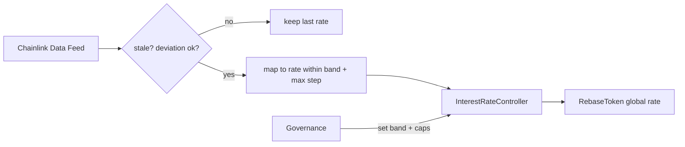

**Trade-off:** Oracle-driven rates add an external dependency and a new manipulation surface (oracle attacks). Bounds, staleness checks, and max-step clamps are mandatory. The upside is a rate that tracks reality instead of an arbitrary constant — a much stronger economic story.

## 5.9 Interest system summary

| Upgrade | Model impact | Priority |
|---|---|---|
| Checkpoint struct + events | Auditability | P1 |
| L10 rate reconciliation (`min`) | Correctness/economic | P0 |
| Rounding invariants (Σbalance ≤ backing) | Solvency | P0 |
| InterestRateController extraction | Modularity | P1 |
| Global/bucketed share index | Precision, path-independence | P2 (v2) |
| Oracle-driven / scheduled rates | Tokenomics | P2 |
| Negative-rate capability | Advanced | P3 (design-only) |

---

# SECTION 6 — Vault Improvements

**`CURRENT`** — `Vault` is ~40 lines: `deposit()` mints RBT 1:1 with ETH at the global rate; `redeem(amount)` burns and sends ETH via low-level `call`; a bare `receive()` accepts reward top-ups. No guard, no pause, no accounting, no fees, no limits. The README explicitly states redemption relies on the vault being externally funded — i.e., **the interest is unbacked** (L3).

The vault is where "educational" most clearly shows. The upgrades below turn it into a solvent, accountable, rate-limited liquidity engine.

## 6.1 Liquidity accounting & the backing invariant

**`UPGRADE`** — Track liabilities and backing explicitly and enforce solvency as an invariant.

Define:
- **Liabilities `L`** = total RBT redeemable = `RebaseToken.totalSupply()` including accrued interest.
- **Backing `B`** = ETH held by vault + value recoverable from any yield strategy + reward reserve.
- **Reserve ratio `R`** = `B / L`.

The vault must maintain accounting such that **`B ≥ L` (fully backed) or a documented, governed partial-backing model with pro-rata redemption**. This is the single most important vault upgrade — it converts "assume funded" into "provably solvent or explicitly, transparently fractional."

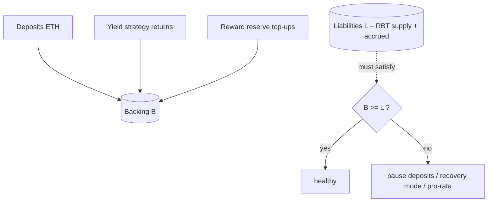

**Trade-off:** Requiring full backing means the yield must come from *somewhere real* (fees or strategy), not from thin air — this is a feature, not a limitation. It forces an honest economic model (§8). A fractional model is possible but must be explicit and pro-rata, never silent.

## 6.2 Where does the yield come from? (resolving L3)

**`UPGRADE`** — Pick and implement at least one real yield source so accrued interest is backed:

| Source | Mechanism | Complexity | Notes |
|---|---|---|---|
| **Reward reserve** | Governance/treasury funds a reserve that pays interest | Low | Honest but requires ongoing funding; good v1 |
| **Native staking / LST** | Vault stakes idle ETH (e.g., into an LST) and yield backs interest | Medium | Realistic yield; adds LST risk + redemption liquidity mgmt |
| **Lending strategy** | Deposit idle ETH into a lending market | Medium | Yield + withdrawal liquidity considerations |
| **Fee-funded** | Protocol fees (deposit/withdraw/performance) fund the reserve | Low–Med | Sustainable if volume is sufficient |

**Recommended path:** v1 = explicit reward reserve + fees; v2 = pluggable strategy interface so the vault can route idle ETH to a yield strategy, with the strategy's returns crediting the reserve. Abstract the strategy behind an interface so strategies can be added/removed by governance without touching the vault core.

**Trade-off:** Real strategies add smart-contract risk (the strategy can lose money) and liquidity risk (funds locked in the strategy aren't instantly redeemable — hence the withdrawal queue §6.4). Start with the reserve model to make the *accounting* correct, then add strategies once the accounting invariants are battle-tested.

## 6.3 Reserve ratio & insurance reserve

**`UPGRADE`** —
- **Target reserve ratio:** Keep an on-chain target (e.g., `R_target = 100%` fully backed, or a buffer above liabilities). Deposits/withdrawals and strategy allocation respect a **liquidity buffer** (a fraction kept liquid for instant redemptions).
- **Insurance reserve:** A separate, governance-owned buffer (funded by a slice of fees) that absorbs strategy losses or shortfalls so users are made whole before the protocol touches principal backing. This is the "capital of last resort."

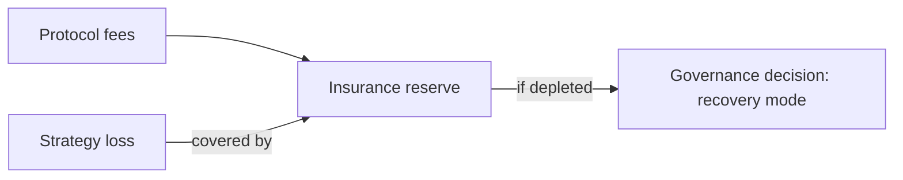

**Trade-off:** Reserves are idle capital (opportunity cost) but are the difference between "a strategy loss wipes out users" and "a strategy loss is absorbed." Size the insurance reserve to a governed fraction of TVL.

## 6.4 Withdrawal queue & paused withdrawals

**`UPGRADE`** — When free liquidity can't cover a redemption instantly (because ETH is deployed in a strategy), enqueue a **pull-based** withdrawal request:

1. `requestRedeem(amount)` burns RBT (or escrows it) and records a claim: `{user, amount, requestTime, claimable}`.
2. A keeper/strategy-unwind funds the queue; `claim(requestId)` pays out when liquid.
3. Requests are processed FIFO or by a fairness policy; **never** via an unbounded on-chain loop — each user pulls their own claim (DoS-safe, §3.11).

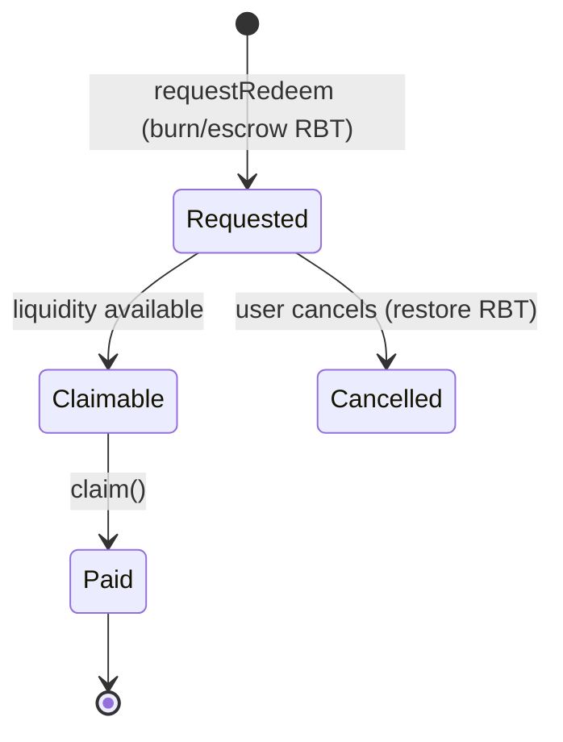

**Paused withdrawals** integrate with §3.2: a redemption pause stops *new* claims but the queue's existing accounting is preserved; governance may enable a `recovery mode` where the queue is served pro-rata.

**Trade-off:** Queues hurt instant-redemption UX and are a trust-sensitive surface (users worry about getting locked in). Mitigate with a generous instant-redemption liquidity buffer (most redemptions never hit the queue) and transparent queue status in the UI (§9). The queue only activates under stress — exactly when you need orderly, non-race-condition redemptions.

## 6.5 Fees: performance, protocol, deposit, withdrawal

**`UPGRADE`** — Introduce a bounded, governance-tunable fee system routed to the Treasury:

| Fee | Basis | Typical range | Purpose |
|---|---|---|---|
| **Deposit fee** | % of deposit | 0–0.5% | Discourage churn; seed reserve (often 0) |
| **Withdrawal fee** | % of redemption | 0–0.5% | Fund reserve; discourage rapid in/out |
| **Performance fee** | % of yield earned | 5–20% | Protocol's cut of generated yield |
| **Bridge fee** | flat or % on bridge | small | Fund cross-chain ops (on top of CCIP fee) |

**Implementation strategy:**
- All fees have **hard caps** enforced in code (governance can set within `[0, cap]`, never above) — this bounds governance's ability to extract value.
- Fees route to `Treasury`; emit `FeeCharged(type, payer, amount)`.
- Performance fee is taken on *realized* yield (strategy returns / reserve growth), not on principal — never on a user's deposited capital.

**Trade-off:** Fees fund sustainability but reduce user yield and add complexity to every value path. Keep them off or minimal at launch (to bootstrap TVL) and enable via governance as the protocol matures. Hard caps are non-negotiable — they're what make the fee system trustless.

## 6.6 Deposit, withdrawal & daily limits

**`UPGRADE`** — Add configurable limits, complementary to the bridge rate limiter (§3.4):

| Limit | Purpose |
|---|---|
| **Max deposit per tx / per address** | Bound single-actor exposure during the risky early phase |
| **Global TVL cap** | Cap total protocol exposure while young ("guarded launch") |
| **Daily net-flow limit** | Throttle mass in/out; feeds the circuit breaker |
| **Min deposit** | Avoid dust-account griefing / uneconomic accrual |

**Implementation strategy:** Time-bucketed accumulators (reset per epoch) for daily limits; simple bounds for per-tx/per-address; a global `totalDeposited ≤ cap` check. All governance-tunable within caps.

**Trade-off:** Limits constrain growth and can frustrate large depositors, but a **guarded launch** (low caps, raised over time as confidence grows) is the single most effective way to bound early-life risk. Every serious protocol launches guarded.

## 6.7 Vault interaction map

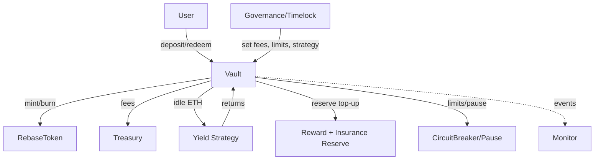

## 6.8 Vault upgrades summary

| Upgrade | Solvency impact | Priority |
|---|---|---|
| Reentrancy guard + pause | Safety | P0 |
| Liquidity accounting + backing invariant | Solvency | P0 |
| Yield source (reserve → strategy) | Solvency | P0/P1 |
| Deposit/TVL/daily limits (guarded launch) | Risk | P0 |
| Fees → Treasury (capped) | Sustainability | P1 |
| Withdrawal queue (pull-based) | Liquidity | P1 |
| Insurance reserve | Resilience | P2 |
| Pluggable strategy interface | Yield | P2 |

---

# SECTION 7 — Governance

**`CURRENT`** — A single `onlyOwner` (deployer EOA or, at best, a multisig) has instant, unilateral authority to set the rate and grant mint/burn roles. No delay, no voting, no separation between "change value" and "stop the protocol."

The governance design formalizes *who can do what, how fast, and with what oversight* — the separation-of-powers principle from §2.1.

## 7.1 Governance architecture

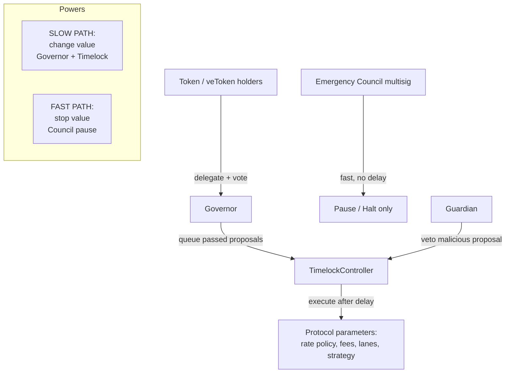

## 7.2 Components

| Component | Implementation | Authority | Speed |
|---|---|---|---|
| **Governor** | OZ `Governor` (+ `GovernorVotes`, `GovernorTimelockControl`) | Propose & vote on parameter changes | Days (voting period) |
| **Timelock** | OZ `TimelockController` | Executes passed proposals after delay | Delay (24–72h) |
| **Emergency Council** | Gnosis Safe multisig | Pause/halt only; **cannot move funds or change rate** | Instant |
| **Guardian** | Multisig or role | Veto/cancel a queued malicious proposal during the timelock window | Within delay window |
| **Voting token** | RBT balance snapshot or a dedicated gov token / veToken | Voting weight | — |

## 7.3 Proposal lifecycle

```mermaid
stateDiagram-v2
    [*] --> Pending: propose()
    Pending --> Active: voting delay elapses
    Active --> Defeated: quorum not met / no majority
    Active --> Succeeded: quorum + majority
    Succeeded --> Queued: queue() into Timelock
    Queued --> Cancelled: Guardian veto (malicious)
    Queued --> Executed: execute() after delay
    Defeated --> [*]
    Cancelled --> [*]
    Executed --> [*]
```

Each stage is public and observable, so users can exit before a controversial change executes — the core value of on-chain governance over an opaque owner key.

## 7.4 Voting design

| Parameter | Recommendation | Rationale |
|---|---|---|
| **Vote weight** | Balance snapshot at proposal start (ERC20Votes checkpoints) | Prevents buying votes after seeing the proposal |
| **Quorum** | e.g., 4% of supply | Balances participation vs. capturability |
| **Voting delay** | ~1 day | Lets holders react before voting opens |
| **Voting period** | ~3–5 days | Enough time for global participation |
| **Proposal threshold** | Small % to propose | Anti-spam without over-gating |
| **Vote type** | For / Against / Abstain | Standard; abstain counts to quorum |

**veToken option:** For stronger alignment, vote-escrow (lock tokens for time-weighted voting power) rewards long-term holders and dampens flash-loan governance attacks. Trade-off: complexity and reduced liquidity for voters.

## 7.5 What governance controls

| Domain | Governed action | Path |
|---|---|---|
| **Interest** | Set rate policy, decay schedule, oracle band | Governor → Timelock → `InterestRateController` |
| **Fees** | Set fees within caps | Governor → Timelock → Vault/Treasury |
| **Bridge** | Add/remove lanes, set rate limits, rotate router | Governor → Timelock → Pool |
| **Strategy** | Add/remove yield strategies, set allocations | Governor → Timelock → Vault |
| **Reserves** | Move reserve funds within policy | Governor → Timelock → Treasury |
| **Upgrades** | Approve UUPS upgrades | Governor → Timelock → proxy |
| **Roles** | Grant/revoke roles | Governor → Timelock → AccessControl |
| **Pause** | Emergency stop | **Council (bypasses governance)** |
| **Unpause** | Resume | Governor/Timelock (deliberate) |

## 7.6 Emergency council & guardian

**Design intent:** The Council exists because *governance is too slow for an active exploit*. But an all-powerful fast key is itself a risk. Resolution:

- **Council can only *subtract*** — pause, halt lanes, trip breakers. It can never mint, move funds, or raise rates.
- **Guardian can only *veto*** — cancel a queued proposal it deems malicious, within the timelock window. It cannot *create* actions.
- Both are multisigs with published signers and thresholds; both emit loud events; both are themselves replaceable by governance.

**Trade-off:** Adding a Council reintroduces a trusted group, contradicting pure decentralization. The mitigation is strict, *subtractive-only* scoping and eventual sunset (governance can dissolve the Council once the protocol is mature). This is the industry-standard compromise (Compound, Aave, etc. all run guardian/pause-guardian roles).

## 7.7 Progressive decentralization

Ship governance in stages so you're never blocked on a DAO to launch:

```mermaid
timeline
    title Progressive decentralization
    Phase 0 : Multisig owner (Timelock-wrapped) : Team controls params behind delay
    Phase 1 : Council + Timelock : Fast pause + delayed value changes
    Phase 2 : Governor added (advisory) : Community signals, team executes
    Phase 3 : Governor binding : On-chain votes execute via Timelock
    Phase 4 : Council sunset : DAO fully controls; emergency powers minimized
```

**Trade-off:** Full decentralization on day one is neither safe (no fast response) nor practical (no voter base). Progressive decentralization is the honest, defensible path — and a great interview narrative about *why* you sequenced trust the way you did.

---

# SECTION 8 — Economic Design

This section makes the protocol *economically coherent*: where value comes from, where it goes, and why it's sustainable. It directly resolves L3 (unbacked yield) and L7 (no revenue).

## 8.1 The central economic question

A yield-bearing token must answer: **"Who pays the yield?"** Today, nobody does — interest is minted into existence with no offsetting backing. Production requires a closed loop where every unit of yield paid to users is sourced from real value.

```mermaid
flowchart LR
    subgraph Inflows
      DEP[User deposits] --> POOL[(Backing pool)]
      STRAT[Strategy yield] --> POOL
      FEES[Protocol fees] --> TREAS[Treasury]
    end
    POOL -->|pays| YIELD[User interest]
    TREAS -->|funds| RESERVE[Reward + insurance reserve]
    RESERVE -->|tops up| POOL
    TREAS -->|funds| OPS[Ops, audits, bounty]
    style POOL fill:#1b4
```

**The invariant:** `interest paid ≤ strategy yield + reserve inflows`. If yield is promised beyond what's earned, the reserve depletes and the protocol becomes insolvent — the model must make this impossible (rate bounded by sustainable yield, or reserve-funded and rate throttled when the reserve is low).

## 8.2 Tokenomics

| Element | Design |
|---|---|
| **RBT (rebase token)** | The yield-bearing claim on the vault; supply = deposits + accrued interest; redeemable for ETH backing |
| **Interest rate** | Bounded by sustainable yield; monotonic-decreasing global rate protects existing holders |
| **Governance token (optional)** | Separate token for voting (or use RBT snapshots); aligns control with stake |
| **Reserve** | Buffer that smooths yield and absorbs losses |

**Design principle:** Keep the *unit of account* (RBT ↔ ETH) simple and fully backed. Don't over-engineer token incentives; the product is "safe cross-chain yield," and complexity is a liability.

## 8.3 Protocol revenue & fee model

Revenue sources, from least to most sustainable:

| Source | Sustainability | Notes |
|---|---|---|
| Deposit/withdrawal fees | Volume-dependent | Small, bootstrap-friendly |
| Performance fee on yield | Scales with TVL × yield | The core long-term revenue |
| Bridge fee | Volume-dependent | Modest; covers cross-chain ops |
| Idle-capital spread | Scales with TVL | Vault earns strategy yield, pays users a (lower) rate, keeps spread |

**The spread model** is the cleanest sustainable design: the vault earns `Y_strategy` on deployed capital, pays users `Y_user < Y_strategy`, and the spread `(Y_strategy − Y_user)` funds the reserve, treasury, and protocol. This is exactly how Aave/Compound and every LST make money, and it makes the yield *inherently backed*.

## 8.4 Yield distribution

```mermaid
flowchart TD
    SY[Strategy yield earned] --> SPLIT{Split}
    SPLIT -->|majority| USERS[User interest]
    SPLIT -->|performance fee| TREAS[Treasury]
    TREAS --> RES[Reserve buffer]
    TREAS --> OPS[Ops / audits / bounty]
    RES -->|smooths lean periods| USERS
```

**Smoothing:** Real yield is variable; user-facing rate should be *smoothed* against the reserve so users see a stable rate while the reserve absorbs volatility. When the reserve is healthy, it can subsidize a slightly higher rate; when depleted, governance lowers the rate (which the monotonic-decrease design already supports gracefully).

## 8.5 Bridge & withdrawal fee rationale

- **Bridge fee** (on top of CCIP's own fee): compensates the protocol for the cross-chain accounting risk and monitoring overhead it takes on. Keep it small — CCIP fees already make bridging non-free, and excessive fees kill the cross-chain UX that is the project's differentiator.
- **Withdrawal fee**: primarily a *behavioral* tool (discourage rapid churn that forces strategy unwinds) and a reserve funder — not a primary revenue source. Consider waiving it for redemptions served from the liquid buffer and applying it only to queue-served redemptions that force an unwind.

## 8.6 Long-term sustainability

| Risk to sustainability | Mitigation |
|---|---|
| Yield promised > yield earned | Rate bounded by realized yield; reserve-gated; throttle when reserve low |
| Strategy loss | Insurance reserve; strategy caps; diversification |
| Bank run (mass redemption) | Liquidity buffer + withdrawal queue + circuit breaker |
| Fee too high → users leave | Governance-tuned, capped; competitive benchmarking |
| Fee too low → protocol can't fund ops/audits | Performance fee scales with TVL; treasury runway targets |
| Cross-chain imbalance (more minted on B than burned on A) | Global supply reconciliation (§4.7); rate limits; monitoring |

**Runway discipline:** Treasury should target a multiple of annual operating cost (audits, bounty, infra) in stable reserves so the protocol survives a bear market without emergency measures.

**Trade-off summary:** The tension is always *user yield vs. protocol sustainability vs. safety buffer*. The spread model plus a governed reserve is the industry-proven balance. Over-paying users wins TVL short-term and risks insolvency; over-charging wins revenue and loses users. Governance exists precisely to tune this over time with real data.

---

# SECTION 9 — Monitoring & Observability

**`CURRENT`** — Minimal events: `Deposit`, `Redeem` (Vault), `InterestRateSet` (Token). No cross-chain events, no analytics, no health surface, no alerting. The frontend's analytics page uses simulated data.

You cannot operate what you cannot see. Observability is a first-class deliverable, not an afterthought — for a cross-chain protocol it's *the* difference between catching an exploit in minutes vs. discovering it when funds are gone.

## 9.1 The observability stack

```mermaid
flowchart LR
    subgraph OnChain["On-chain (source of truth)"]
        EV[Structured events]
        VIEW[View functions / getters]
    end
    subgraph Index["Indexing layer"]
        SUB[Subgraph / indexer]
        LOGS[Log listeners]
    end
    subgraph Compute["Analytics + health"]
        METRICS[Metrics store]
        HEALTH[Health engine / invariant checks]
    end
    subgraph Surface["Surfaces"]
        DASH[Dashboards]
        ALERT[Alerting / paging]
        UI[dApp status widgets]
    end
    EV --> SUB --> METRICS --> DASH
    EV --> LOGS --> HEALTH --> ALERT
    VIEW --> UI
    HEALTH --> UI
```

## 9.2 Events — the on-chain telemetry contract

Every state transition must emit an indexed, structured event. Minimum event catalog:

| Domain | Events |
|---|---|
| Vault | `Deposit`, `Redeem`, `RedeemRequested`, `RedeemClaimed`, `FeeCharged`, `LimitUpdated`, `Paused/Unpaused` |
| Token | `Transfer` (ERC20), `InterestAccrued`, `RateChanged`, `UserRateSet`, `IndexUpdated` |
| Pool | `BridgeInitiated`, `BridgeCompleted`, `MessageExecuted`, `MintFailed`, `RateLimitConsumed`, `LaneConfigured`, `AckReceived` |
| Treasury | `FeeReceived`, `ReserveFunded`, `ReserveWithdrawn`, `StrategyAllocated`, `StrategyLoss` |
| Governance | `ProposalCreated/Queued/Executed/Cancelled`, `RoleGranted/Revoked`, `Upgraded` |
| Safety | `CircuitBreakerTripped`, `RecoveryModeEntered/Exited` |

**Event design rules:** index the fields you'll filter on (user, selector, message hash); include *before/after* values for parameter changes (so an indexer needn't reconstruct prior state); emit exactly one event per logical action.

## 9.3 Metrics & analytics

Derived from events by the indexer:

| Metric | Signal |
|---|---|
| TVL (per chain, total) | Growth / health |
| Reserve ratio `B/L` | **Solvency — the top alert** |
| Effective vs. target rate | Yield sustainability |
| Bridge volume per lane | Usage + risk concentration |
| Bridge latency (initiated→completed) | CCIP health |
| Bridge failure rate | Integration health |
| Rate-limit utilization per lane | Proximity to throttle |
| Net cross-chain supply imbalance | **Bridge integrity — top alert** |
| Fee revenue | Sustainability |
| Withdrawal queue depth + wait time | Liquidity stress |
| Unique users, retention | Product |

## 9.4 Health monitoring & invariant alerting

Run the protocol's core invariants *continuously off-chain* against live state and page a human on violation:

| Invariant | Alert severity |
|---|---|
| `Σ balances ≤ backing` (solvency) | Critical / page |
| `cross-chain minted == burned` (per lane, reconciled) | Critical / page |
| No `messageId` executed twice | Critical / page |
| Reserve ratio ≥ floor | High |
| Rate within governed band | Medium |
| Rate-limit bucket not exhausted unexpectedly | Medium |
| No unexpected role changes | High |
| Pause state consistent across chains | Medium |

```mermaid
flowchart TD
    LIVE[Live chain state + events] --> CHK[Invariant checks every block/epoch]
    CHK -->|ok| OK[green dashboard]
    CHK -->|violation| SEV{severity}
    SEV -->|critical| PAGE[page on-call + auto-suggest pause]
    SEV -->|high| ALERT[alert channel]
    SEV -->|medium| LOG[log + dashboard flag]
```

## 9.5 Alerting & error reporting

- **Channels:** page (PagerDuty/Opsgenie) for critical; Slack/Discord for high/medium; dashboard for informational.
- **Auto-response hooks:** critical solvency/bridge alerts can *pre-stage* a Guardian pause transaction for one-click execution (never auto-execute value changes, but make stopping instant).
- **Error reporting:** `MintFailed`, `CircuitBreakerTripped`, and CCIP manual-execution-needed events feed a triage queue with the message hash for direct lookup.

## 9.6 Cross-chain status surface

Because the protocol spans chains, provide a unified status view answering: *Is any lane paused? Any message stuck? Any rate-limit near exhaustion? Is supply reconciled across chains?* Expose this both to ops (dashboard) and users (dApp widget) — transparency about cross-chain health is a trust feature.

## 9.7 dApp integration (turning the frontend into evidence)

- Replace simulated analytics with **real event-sourced data** (index `Transfer`, `InterestAccrued`, `RateChanged`, bridge events).
- Add **"verify on-chain"** explorer links next to every address, balance, and tx.
- Show **live reserve ratio and bridge status** so users see the protocol is solvent and healthy in real time.

**Trade-off:** A full observability stack (indexer + dashboards + paging) is real infra work and cost. Scope it to the *critical* invariants first (solvency, bridge integrity, replay) — those three catch the catastrophic failures; everything else is refinement.

---

# SECTION 10 — Testing Strategy

**`CURRENT`** — `RebaseToken.t.sol` (unit + some fuzz) and `CrossChain.t.sol` (fork-based CCIP integration across Sepolia ↔ Arb Sepolia). Good foundation; not nearly enough surface for a protocol that holds money across chains.

The testing philosophy for production DeFi: **assume every function is called by an adversary, in every order, with every value, across chain-reorg and message-failure conditions.** Tests are the primary evidence of correctness — more than the code itself.

## 10.1 Test pyramid

```mermaid
flowchart TD
    subgraph Pyramid
      U[Unit tests — fast, exhaustive per-function]
      I[Integration tests — contract-to-contract]
      F[Fork tests — real CCIP + real chain state]
      INV[Invariant / property tests — the safety net]
      E2E[E2E / chaos / attack simulations]
    end
    U --> I --> F --> INV --> E2E
    style INV fill:#1b4
```

## 10.2 Unit tests

Per contract, cover every branch and revert:

| Contract | Must-test cases |
|---|---|
| RebaseToken | mint/burn access control; balance accrual math at t=0, t=Δ, large Δ; rate monotonicity revert; transfer rate-inheritance rules (zero vs non-zero recipient); L10 `min` reconciliation; precision at boundaries (1 wei, max uint) |
| Vault | deposit/redeem happy path; pause reverts; reentrancy guard; limit reverts; fee math; queue enqueue/claim/cancel; backing invariant per action |
| Pool | version decode/dispatch; hash mismatch revert; replay-set reject; trusted-remote reject; rate-limit consume/throttle; unsupported chain/version reverts |
| Controller | rate band clamping; oracle staleness/deviation reject; max-step clamp |
| Treasury | fee routing; reserve accounting; strategy loss handling; rescue exclusion of protocol assets |
| Governance | proposal lifecycle; timelock delay enforcement; council pause-only scope; guardian veto |

## 10.3 Integration tests

Multi-contract flows on a single chain: deposit→accrue→redeem with fees; deposit→bridge-out (mock router)→state; governance proposal→timelock→parameter applied→effect observed; circuit-breaker trip→pause→recovery.

## 10.4 Fork tests

Extend the existing `CCIPLocalSimulatorFork` suite:
- Real bidirectional bridging (already present) **plus**: bridge with rate limits enabled (throttle path), bridge with version mismatch, bridge with a paused destination, bridge-back rate reconciliation (L10), and multi-hop (A→hub→B) if hub-and-spoke.
- Fork against *live* deployed contracts before each mainnet-ish deploy to catch config drift.

## 10.5 Invariant / property tests (the most important addition)

Foundry invariant testing with a stateful handler that fires random sequences of deposit/redeem/transfer/bridge/accrue and asserts, after *every* sequence:

| Invariant | Statement |
|---|---|
| **Solvency** | `Σ balanceOf(user) ≤ backing` always |
| **Supply consistency** | `totalSupply == Σ principals` after accrual folding |
| **Cross-chain conservation** | `Σ minted_dest == Σ burned_src` per lane |
| **No replay** | each `messageId` mints exactly once |
| **Rate monotonicity** | global rate never increases |
| **Rate reconciliation** | no user's rate ever exceeds their entitled max after a bridge |
| **Fee bounds** | fees never exceed configured caps; user principal never taken as fee |
| **Reserve floor** | reserve ratio never silently drops below floor without pause/recovery |

**Why this matters most:** unit tests check the cases you *thought of*; invariant tests check the cases you *didn't*. For a financial protocol, the invariant suite is the strongest correctness evidence you can produce and the thing auditors respect most.

## 10.6 State-machine tests

Model each stateful component (withdrawal queue, message lifecycle, proposal lifecycle, pause/recovery states) as an explicit FSM and assert only legal transitions occur — no `Executed → Executed`, no `Paused → deposit`, no `Claimed → Claimed`.

## 10.7 Differential tests

Where a reference implementation exists (e.g., the interest formula, or an index model vs. a linear model), compute the expected result in a second implementation (a simple Python/JS oracle, or a naive on-chain reference) and assert equivalence across fuzzed inputs. Especially valuable when migrating the interest model (§5.3) — differential-test the new index model against the old linear model to prove economic equivalence (or characterize the intended difference).

## 10.8 Fuzz tests

Property-based fuzzing on every numeric input: amounts (1 wei → type(uint).max), time deltas (0 → decades), rates (0 → cap), and encoded payloads (malformed bytes must revert, never mis-decode). Fuzz the payload decoder specifically — it's the untrusted-input boundary.

## 10.9 Gas tests

Snapshot gas for every hot path (`forge snapshot`) and gate CI on regressions beyond a threshold. Track deposit, redeem, transfer, bridge-out, bridge-in. Gas is a correctness and UX property for a high-frequency token.

## 10.10 Chaos & bridge-failure simulation

Simulate the adversarial cross-chain conditions CCIP abstracts but reality won't:
- **Message never arrives / arrives late** — assert source accounting is correct while pending.
- **Message fails on destination** (out of gas, paused, reverting receiver) — assert no double-spend, funds recoverable via manual execution, correct events.
- **Duplicate delivery attempt** — replay set rejects.
- **Reorg on source after send** — assert idempotency.
- **Rate-limit exhaustion mid-flow** — assert clean throttle/queue, no stuck state.

## 10.11 Attack simulations

Encode known attack classes as tests that *must fail to profit the attacker*: reentrancy on redeem/claim; cross-chain replay; spoofed source pool; rate front-running around a scheduled change; oracle manipulation of the rate; griefing the withdrawal queue; fee/rounding extraction; role-escalation attempts.

## 10.12 Coverage goals & CI automation

| Target | Goal |
|---|---|
| Line coverage | ≥ 95% on `src/` |
| Branch coverage | ≥ 90% |
| Invariant suite | Runs in CI, deep run nightly |
| Every revert | Has a test asserting the revert reason |
| Mutation testing (stretch) | Kill ≥ 80% of mutants |

**CI pipeline:**

```mermaid
flowchart LR
    PR[Pull request] --> FMT[forge fmt --check]
    FMT --> BUILD[forge build --sizes]
    BUILD --> UNIT[forge test unit+fuzz]
    UNIT --> INV[invariant suite]
    INV --> FORK[fork tests gated by secrets]
    FORK --> COV[forge coverage >= threshold]
    COV --> SLITHER[static analysis: Slither/Aderyn]
    SLITHER --> GAS[gas snapshot diff]
    GAS --> GREEN[merge allowed]
```

**Trade-off:** A deep test suite is slow (fork + invariant runs take minutes) and expensive to maintain. Split fast (unit/fuzz on every PR) from slow (deep invariant + fork on merge/nightly) so developer feedback stays quick while coverage stays deep.

---

# SECTION 11 — Gas Optimization

Gas optimization is applied *after* correctness and security — never at their expense. The goal is to reduce user cost on hot paths (deposit, redeem, transfer, bridge) without sacrificing readability or safety. Every optimization below must be justified by a `forge snapshot` delta, not vibes.

## 11.1 Storage packing

**`CURRENT`** — `RebaseToken` uses full `uint256` for `s_interestRate`, `s_userInterestRate`, `s_userLastUpdatedTimestamp` — each a full slot; the two per-user mappings are separate slots per user.

**`UPGRADE`** —
- Pack per-user state into a single struct/slot where ranges allow: `rate` fits in `uint96`/`uint128`, `timestamp` in `uint40` (good past year 34000), leaving room in one 32-byte slot. One `SSTORE` instead of two on accrual.
- Pack global config (rate `uint96` + flags + small counters) into one slot.

**Trade-off:** Packing saves gas (fewer cold `SLOAD`/`SSTORE`) but reduces the safe numeric range and adds masking cost on partial-slot writes. Verify the ranges can never overflow (e.g., rate cap enforces the `uint96` bound) and test boundary values.

## 11.2 Immutable & constant variables

**`CURRENT`** — `PRECISION_FACTOR` is `constant` (good); `MINT_AND_BURN_ROLE` is `constant` (good); `Vault.i_rebaseToken` is `immutable` (good).

**`UPGRADE`** — Apply the same discipline to new contracts: router, RMN proxy, token address, and any deploy-time-fixed config as `immutable` (no `SLOAD`, embedded in bytecode). Anything truly fixed → `constant`.

**Trade-off:** None meaningful — immutables are strictly cheaper for read-heavy fixed values. Just ensure they're genuinely fixed for the contract's life (immutables can't be changed by an upgrade of a UUPS *implementation* the way storage can — plan accordingly).

## 11.3 Unchecked blocks

**`UPGRADE`** — Wrap arithmetic that is provably non-overflowing (loop counters, subtractions guarded by a prior `require`, timestamp deltas where `now ≥ last` is guaranteed) in `unchecked`. The interest math has several such spots (e.g., `now − lastUpdated` is always ≥ 0 by construction).

**Trade-off:** `unchecked` removes the compiler's overflow guard — a bug becomes a silent wrap instead of a revert. Only use it where a comment *proves* safety, and cover it with fuzz tests at boundaries. Never `unchecked` on user-influenced multiplication.

## 11.4 Assembly opportunities

**`UPGRADE`** — Reserve inline assembly for narrow, high-value, well-audited spots: efficient hashing of the payload, custom-error reverts, or batch calldata decoding. Use OZ's audited helpers (`Math.mulDiv`) rather than hand-rolling.

**Trade-off:** Assembly is the highest-risk optimization — it bypasses the type system and is a top audit-finding source. Only use where the gas win is large *and* the code is small enough to audit line-by-line. For most of this protocol, high-level Solidity with packing gets 90% of the benefit at 10% of the risk. Default to *not* using assembly.

## 11.5 Calldata usage

**`UPGRADE`** — Use `calldata` (not `memory`) for external function array/bytes parameters (e.g., the CCIP payload, batch inputs) to avoid a memory copy. Pass structs as `calldata` where not mutated.

**Trade-off:** None significant; `calldata` is strictly cheaper for read-only external params. Just can't mutate calldata in place.

## 11.6 Memory optimization

**`UPGRADE`** — Avoid redundant `balanceOf` recomputation (the current `_mintAccruedInterest` calls `balanceOf` which recomputes — cache the result). Minimize memory expansion in loops; reuse buffers; avoid copying large structs.

**Trade-off:** Caching adds local variables (stack pressure) but removes recomputation — usually a clear win. Watch "stack too deep" on functions with many locals; refactor into structs or internal helpers.

## 11.7 Event optimization

**`UPGRADE`** — Index only what you filter on (each indexed arg is a topic, slightly more gas but enables filtering; non-indexed is cheaper but only readable, not filterable). Don't over-index. Emit compact events (avoid redundant fields derivable off-chain).

**Trade-off:** More indexed fields = better queryability, marginally more gas. Balance per §9's filtering needs.

## 11.8 Custom errors

**`CURRENT`** — Already uses custom errors (`RebaseToken__InterestRateCanOnlyDecrease`, `Vault__RedeemFailed`) — good, modern practice.

**`UPGRADE`** — Extend custom errors everywhere (replace any `require` strings), include useful parameters in the error (amounts, limits) for debuggability, and keep a documented error catalog.

**Trade-off:** Custom errors are cheaper than string reverts and more informative — pure win. Only cost is discipline in naming/documenting them.

## 11.9 Minimal storage writes

**`UPGRADE`** —
- Skip no-op writes (don't `SSTORE` a value equal to the current one — guard with a read, which is cheaper than a write).
- Batch related writes into one packed-slot update.
- Prefer transient storage (EIP-1153) for within-tx scratch state (e.g., reentrancy guard) on Cancun+ chains.
- Avoid writing on read paths; keep accrual lazy (already the design).

**Trade-off:** Read-before-write to skip no-op stores adds an `SLOAD` — only worth it when writes are likely no-ops. Packing requires the range discipline of §11.1.

## 11.10 Gas optimization discipline

| Rule | Rationale |
|---|---|
| Measure first (`forge snapshot`) | Never optimize blind |
| Correctness/security > gas, always | An optimized exploit is still an exploit |
| Comment every `unchecked`/assembly with a safety proof | Auditability |
| Re-run invariant tests after each optimization | Optimizations reorder logic and break invariants |
| Gate CI on gas regressions | Prevent silent creep |

---

# SECTION 12 — Developer Experience

Production quality is partly about the code and partly about the *repository as a professional artifact*. A reviewer (or auditor, or hiring manager) forms judgments in the first minute from structure, docs, and CI — before reading a single contract.

## 12.1 Folder structure

**`UPGRADE`** — Evolve toward a conventional, scalable layout:

```
src/
  token/        RebaseToken + interest logic
  vault/        Vault, WithdrawalQueue, strategy interface
  bridge/       RebaseTokenPool, message codec, lane registry
  interest/     InterestRateController, oracle adapter
  treasury/     Treasury, reserve
  governance/   Governor, Timelock config, Council
  safety/       CircuitBreaker, Pausable mixins
  interfaces/   all external interfaces
  libraries/    shared math, codec, errors
script/
  deploy/       per-contract + orchestration
  config/       lane onboarding, param setting
  ops/          pause, retry, rescue runbook scripts
test/
  unit/ integration/ fork/ invariant/ attack/
docs/
  DESIGN_DECISIONS.md ARCHITECTURE.md SECURITY.md THREAT_MODEL.md
config/
  chains.json   per-chain selectors/routers/RMN
```

**Trade-off:** More structure has a small navigation cost for a tiny repo but pays off as the protocol grows and when onboarding auditors/contributors. The current flat `src/` is fine for 3 contracts; the target has ~10+.

## 12.2 Deployment scripts & configuration

**`CURRENT`** — Deploy scripts hardcode via `CCIPLocalSimulatorFork.getNetworkDetails` and per-chain calls; lane config is manual.

**`UPGRADE`** —
- **Config-driven deploys:** read chain params from `config/chains.json` so adding a chain is a data change. One idempotent orchestration script per environment.
- **Deterministic addresses** (CREATE2) for the token/pool so cross-chain addresses are predictable and lane config can be pre-computed.
- **Post-deploy verification script** that asserts roles, ownership → Timelock, rate limits enabled, and registry wiring — fail loudly if any invariant is off.
- **Renounce/handover step** baked into deploy (transfer admin to Timelock, renounce deployer) and *tested*.

## 12.3 Documentation & NatSpec

**`UPGRADE`** —
- **Full NatSpec** on every external/public function (`@notice` user-facing, `@dev` implementer-facing, `@param`/`@return`), plus `@custom:security` notes on privileged functions.
- **`docs/` set:** `ARCHITECTURE.md` (this doc's §2 distilled), `SECURITY.md` (threat model + assumptions + known limitations), `DESIGN_DECISIONS.md` (the tradeoffs — why lazy accrual, why monotonic rate, why per-user rates preserved), `RUNBOOK.md` (incident response: how to pause, retry, rescue).
- **Auto-generated docs** from NatSpec (`forge doc`) published to a docs site.

## 12.4 README improvements

Lead with the *hard part*: a "Why this is interesting" section (cross-chain state, lazy accrual, monotonic rate), architecture diagrams, a live demo GIF, explorer links for every deployed contract on every chain, a CI + coverage badge, and a security section. Move setup/quickstart below the fold. The README is the protocol's landing page.

## 12.5 Makefile / task runner

**`UPGRADE`** — A `Makefile` (or `justfile`) with memorable targets: `make build test fmt lint slither coverage snapshot deploy-sepolia configure-lane verify` — so every common operation is one command and CI and humans run the *same* commands.

## 12.6 Linting & formatting

**`CURRENT`** — `forge fmt --check` in CI (good).

**`UPGRADE`** — Add `solhint` (style + security lint rules), enforce `forge fmt`, and lint the frontend (ESLint/Prettier) too. Fail CI on lint violations.

## 12.7 GitHub Actions

**`CURRENT`** — One workflow (fmt/build/test). Note: it sets `FOUNDRY_PROFILE: ci` but `foundry.toml` defines only `[profile.default]` — **add a real `[profile.ci]`** (e.g., higher fuzz runs, optimizer settings) so the CI env is intentional, not accidentally falling back.

**`UPGRADE`** — Expand into multiple workflows:

| Workflow | Trigger | Steps |
|---|---|---|
| `ci.yml` | PR/push | fmt, lint, build, unit+fuzz, coverage gate, gas diff |
| `security.yml` | PR/nightly | Slither, Aderyn, invariant deep-run |
| `fork.yml` | merge/nightly | fork tests (RPC secrets) |
| `release.yml` | tag | build, changelog, artifacts, deploy dry-run |

## 12.8 Release workflow & semantic versioning

**`UPGRADE`** — Adopt SemVer (`vMAJOR.MINOR.PATCH`) with clear rules: MAJOR = storage-layout or message-schema breaking change; MINOR = backward-compatible feature; PATCH = fix. Tag releases, generate changelogs (Conventional Commits), and record deployed addresses per version per chain in a committed `deployments/` manifest. For upgradeable contracts, version the *implementation* and record the upgrade proposal + timelock tx in the changelog.

**Trade-off:** Release discipline is overhead for a solo project but is exactly the "operates like a team" signal that separates senior work from hobby work — and it's invaluable the moment more than one person (or one chain) is involved.

---

# SECTION 13 — Future Roadmap

This section looks beyond the production hardening (v1) into the multi-version evolution that turns the protocol from "a solid cross-chain yield token" into "a cross-chain yield *platform*." Each item notes its dependency and the resume/technical signal it carries.

## 13.1 Version map

```mermaid
timeline
    title Protocol version roadmap
    v1 Production Hardening : Security, pause, timelock, backing, versioned bridge, monitoring, tests
    v2 Economic + Governance : Fees, treasury, yield strategy, Governor+Timelock live, oracle rates, index model
    v3 Cross-chain Platform : Cross-chain governance, cross-chain staking, multi-token, LST integration
    v4 Interop + AA : Intent layer, ERC-7683, account abstraction, multi-bridge (LayerZero/Hyperlane/Axelar/Wormhole)
```

## 13.2 Version 2 — Economic & governance maturity

| Feature | Builds on | Signal |
|---|---|---|
| Fees + Treasury live | §6, §8 | Sustainable protocol economics |
| Yield strategy (LST/lending) | §6.2 | Real backed yield, not minted air |
| Governor + Timelock binding | §7 | Decentralized control |
| Oracle-driven / scheduled rates | §5.8 | Dynamic tokenomics |
| Global/bucketed index model | §5.3 | Precise, path-independent accrual |

## 13.3 Version 3 — Cross-chain platform

| Feature | Description | Dependency | Signal |
|---|---|---|---|
| **Cross-chain governance** | A vote on the hub chain updates rate/params on all chains via a versioned `GOVERNANCE` CCIP message; reuses the pool's codec for a second message type | §4.2 versioning, §4.7 sync, §7 | "CCIP as a general message bus, not just a bridge" — a strong senior signal |
| **Cross-chain staking** | Stake RBT on any chain, accrue boosted rewards, with stake state synced to the hub | §4.7, §5 | Composable cross-chain state |
| **Multi-token support** | Vault accepts multiple assets (e.g., stablecoins, LSTs), each with its own rebase token and backing | §6 | Generalized vault architecture |
| **LST integration** | Back the vault with a liquid staking token so idle capital earns native staking yield | §6.2 | Real DeFi yield plumbing |
| **Restaking** | Route backing into a restaking protocol for additional yield (with the added slashing risk modeled in the insurance reserve) | §6.3, §8 | Cutting-edge yield stack awareness |

## 13.4 Version 4 — Interoperability & account abstraction

| Feature | Description | Signal |
|---|---|---|
| **Intent layer** | Users express "I want RBT on chain X" and solvers fulfill optimally across bridges | Modern interop design |
| **ERC-7683 (cross-chain intents)** | Adopt the standard intent/settlement interface so the protocol plugs into the emerging intent ecosystem | Standards fluency |
| **Account abstraction / ERC-4337** | Smart-account UX: gasless deposits (paymaster), batched deposit+bridge, session keys | AA fluency |
| **Multi-bridge abstraction** | Route messages over CCIP *and* LayerZero, Hyperlane, Axelar, or Wormhole behind a common `IMessenger` interface, choosing per-lane by cost/security/availability | Bridge-agnostic architecture — the strongest interop signal |

### Multi-bridge abstraction design

```mermaid
graph TB
    APP[Protocol message layer] --> IM[IMessenger interface]
    IM --> CCIP[CCIP adapter]
    IM --> LZ[LayerZero adapter]
    IM --> HYP[Hyperlane adapter]
    IM --> AXL[Axelar adapter]
    IM --> WH[Wormhole adapter]
    subgraph Selection
      POLICY[Per-lane policy:<br/>cost / security / liveness]
    end
    POLICY --> IM
```

**Design principle:** Abstract the *transport* behind an `IMessenger` interface so the protocol logic (versioned payload, replay set, trusted-remote checks, ACKs) is bridge-agnostic. Each bridge becomes a swappable adapter. This future-proofs against any single bridge's compromise or deprecation and lets governance pick the best transport per lane.

**Trade-off:** Each additional bridge is a new trust root and a new integration/audit surface — more bridges ≠ strictly safer (it can widen the attack surface). The value is *optionality and redundancy*, not blind accumulation. Add bridges deliberately, keep CCIP as the primary, and require the same app-level guarantees (versioning, replay, trusted-remote) from every adapter.

## 13.5 Possible additions (opportunistic)

- **Solana / SVM destination** (cross-VM bridging — a rare, high-signal differentiator; requires a Rust/Anchor pool program reimplementing the interest metadata decode; treat as a separate initiative).
- **Move-based chains** (Aptos/Sui) as the next non-EVM family.
- **Permit / gasless approvals** (ERC-2612) for one-tx deposits.
- **Rewards/points program** layered on the index model.
- **Real-time risk dashboard** as a public trust artifact.

---

# SECTION 14 — Implementation Order

This is the execution plan. It is sequenced so the protocol is **shippable and safer at the end of every phase** — never a big-bang rewrite. Earlier phases are pure risk reduction on the existing system; later phases add capability.

**Difficulty scale:** ⭐ (trivial) → ⭐⭐⭐⭐⭐ (hard, audit-critical). **Time estimates** assume one focused engineer.

## 14.1 Phase overview

```mermaid
gantt
    title Implementation phases
    dateFormat X
    axisFormat %s
    section Safety
    P0 Safety rails            :p0, 0, 2
    section Bridge
    P1 Bridge hardening        :p1, 2, 3
    section Economics
    P2 Vault solvency + fees   :p2, 5, 3
    section Control
    P3 Governance + timelock   :p3, 8, 3
    section Interest
    P4 Interest model v2       :p4, 11, 3
    section Ops
    P5 Monitoring + tests      :p5, 14, 3
    section Platform
    P6 Cross-chain platform    :p6, 17, 4
```

---

### Phase 0 — Safety rails (do first, always)

| Field | Detail |
|---|---|
| **Objectives** | Add the ability to *stop* and *contain* before adding any new value logic. |
| **Contracts modified** | `RebaseToken`, `Vault`, `RebaseTokenPool` |
| **Contracts added** | Pause mixin, role taxonomy (no Governor yet — roles held by a multisig) |
| **Work items** | `Pausable` (scoped pauses) + `ReentrancyGuard` on Vault; role refactor to explicit `AccessControl`; enable CCIP rate limits on all lanes; two-step admin handover |
| **Dependencies** | None |
| **Difficulty** | ⭐⭐ |
| **Est. time** | 3–5 days |
| **Testing** | Unit: every pause/guard revert; access-control matrix; rate-limit throttle path; fork test with limits enabled |
| **Security review** | Pause authority asymmetry (fast pause / slow unpause); reentrancy on redeem/claim; role least-privilege; no function left unpausable that should be |
| **Definition of Done** | Every state-changing entrypoint is pausable + guarded; rate limits enabled on live lanes; deployer admin renounced to multisig; all tests green; gas snapshot recorded |

---

### Phase 1 — Bridge hardening

| Field | Detail |
|---|---|
| **Objectives** | Make the cross-chain message format versioned, hashed, replay-proof, and observable. |
| **Contracts modified** | `RebaseTokenPool` |
| **Contracts added** | Message codec library, lane registry, replay set, `CircuitBreaker` |
| **Work items** | Versioned payload + dispatch; payload hashing; protocol-level replay set; trusted-remote (pool/token/selector) checks; bridge event catalog; circuit breaker (aggregate flow) |
| **Dependencies** | Phase 0 (pause hooks for the breaker) |
| **Difficulty** | ⭐⭐⭐⭐ |
| **Est. time** | 1–2 weeks |
| **Testing** | Fuzz the decoder (malformed bytes revert); replay rejection; trusted-remote rejection; version dispatch; chaos/bridge-failure sims; breaker trip → pause |
| **Security review** | Payload integrity binding; version rollout ordering; replay-set key choice; breaker false-positive/negative tuning; trusted-remote coverage |
| **Definition of Done** | All cross-chain messages versioned+hashed; replay impossible (invariant test); untrusted source rejected; breaker trips on simulated anomaly; bridge fully event-instrumented |

---

### Phase 2 — Vault solvency & fees

| Field | Detail |
|---|---|
| **Objectives** | Make yield *backed* and introduce sustainable revenue. Resolve L3/L7/L8. |
| **Contracts modified** | `Vault`, `RebaseToken` (accrual events) |
| **Contracts added** | `Treasury`, reward/insurance reserve, withdrawal queue, strategy interface (impl optional) |
| **Work items** | Liquidity accounting + backing invariant; reward reserve; capped fees → Treasury; deposit/TVL/daily limits (guarded launch); pull-based withdrawal queue; L10 rate reconciliation |
| **Dependencies** | Phase 0 |
| **Difficulty** | ⭐⭐⭐⭐ |
| **Est. time** | 1.5–2 weeks |
| **Testing** | Invariant: `Σbalance ≤ backing` always; fee bounds; queue FSM; limit reverts; reconciliation (`min`) rules |
| **Security review** | Solvency invariant coverage; fee never touches principal; rescue excludes protocol assets; queue DoS-safety (pull-only); reserve accounting |
| **Definition of Done** | Backing invariant enforced + invariant-tested; fees flow to Treasury within caps; guarded-launch limits active; queue works under a simulated liquidity crunch; L10 closed |

---

### Phase 3 — Governance & timelock

| Field | Detail |
|---|---|
| **Objectives** | Separate powers; make privileged changes delayed and vetoable. Resolve L5. |
| **Contracts modified** | All (admin → Timelock) |
| **Contracts added** | `TimelockController`, `Governor`, Emergency Council multisig, Guardian |
| **Work items** | Deploy Timelock; migrate all admin roles to it; wire Governor (start advisory); Council pause-only scope; Guardian veto; progressive-decentralization plan |
| **Dependencies** | Phases 0–2 (things to govern) |
| **Difficulty** | ⭐⭐⭐ |
| **Est. time** | 1–1.5 weeks |
| **Testing** | Proposal lifecycle; timelock delay enforced; Council can pause but *not* move value/rate; Guardian veto; role migration completeness |
| **Security review** | No residual unilateral owner; Council strictly subtractive; timelock delay adequate; upgrade path (if any) governed |
| **Definition of Done** | Every value-changing action routes through Timelock; Council pauses fast but can't change value; deployer has no residual power; governance flow tested end-to-end |

---

### Phase 4 — Interest model v2

| Field | Detail |
|---|---|
| **Objectives** | Precision, path-independence, and dynamic/oracle-driven rates. |
| **Contracts modified** | `RebaseToken` |
| **Contracts added** | `InterestRateController`, oracle adapter |
| **Work items** | Checkpoint struct + events; extract rate policy to controller; global/bucketed index model (differential-tested vs. old model); oracle-driven rate with staleness/deviation/max-step bounds |
| **Dependencies** | Phase 3 (controller governed) |
| **Difficulty** | ⭐⭐⭐⭐⭐ |
| **Est. time** | 2–3 weeks (model migration is delicate) |
| **Testing** | Differential test new vs. old model; precision/rounding invariants; oracle failure modes; migration correctness (no balance discontinuity) |
| **Security review** | Migration doesn't alter existing balances unexpectedly; index math precision; oracle manipulation bounds; negative-rate exclusion (if chosen) |
| **Definition of Done** | Rate policy externalized + governed; index model live and differential-tested; oracle integration bounded and fault-tolerant; no balance discontinuity across migration |

---

### Phase 5 — Monitoring & test depth

| Field | Detail |
|---|---|
| **Objectives** | Make the protocol operable and prove it correct. |
| **Contracts modified** | Event enrichment across all |
| **Contracts added** | Indexer/subgraph, dashboards, alerting (off-chain) |
| **Work items** | Full event catalog; indexer; solvency + bridge-integrity + replay invariant monitors with paging; dApp real-data + verify-on-chain; deep invariant/attack/chaos test suites; CI expansion (coverage gate, Slither, gas diff, `[profile.ci]`) |
| **Dependencies** | Phases 0–4 (things to monitor) |
| **Difficulty** | ⭐⭐⭐ |
| **Est. time** | 1.5–2 weeks |
| **Testing** | The suite *is* the deliverable; ≥95% line / ≥90% branch; nightly deep invariant runs |
| **Security review** | Alert coverage of every critical invariant; runbook rehearsed; auto-pause staging tested |
| **Definition of Done** | Live dashboards + paging on critical invariants; dApp shows real data + explorer links; coverage gates in CI; runbook exists and was dry-run |

---

### Phase 6 — Cross-chain platform (v3+)

| Field | Detail |
|---|---|
| **Objectives** | Cross-chain governance, staking, multi-token, multi-bridge. |
| **Contracts modified** | Pool (new msg types), Governor |
| **Contracts added** | Cross-chain gov executor, staking, multi-token vaults, `IMessenger` adapters |
| **Work items** | `GOVERNANCE`/`RATE_SYNC` message types over the versioned codec + ACKs; cross-chain staking; multi-asset vault; LST backing; multi-bridge abstraction |
| **Dependencies** | Phases 1–5 |
| **Difficulty** | ⭐⭐⭐⭐⭐ |
| **Est. time** | 4+ weeks (multi-initiative) |
| **Testing** | Cross-chain governance E2E on forks; ACK/retry; multi-bridge adapter parity; staking + reconciliation invariants |
| **Security review** | Control-plane message auth; ACK spoofing; per-adapter trust assumptions; cross-chain governance replay |
| **Definition of Done** | A hub-chain vote provably updates params on a spoke chain via a blessed, versioned, ACKed message; each new capability carries the same security guarantees as the token path |

## 14.2 Phase dependency graph

```mermaid
graph LR
    P0[P0 Safety] --> P1[P1 Bridge]
    P0 --> P2[P2 Vault]
    P1 --> P3[P3 Governance]
    P2 --> P3
    P3 --> P4[P4 Interest v2]
    P4 --> P5[P5 Monitoring/Tests]
    P2 --> P5
    P5 --> P6[P6 Platform]
    P1 --> P6
```

---

# SECTION 15 — GitHub Milestones

Each phase from §14 maps to a GitHub milestone. Labels follow a consistent taxonomy so the board is filterable. Priorities: **P0** (blocker/safety) → **P3** (nice-to-have).

**Label taxonomy:** `area:token` `area:vault` `area:bridge` `area:interest` `area:governance` `area:treasury` `area:monitoring` `area:testing` `area:devex` · `type:feature` `type:security` `type:refactor` `type:docs` `type:test` · `priority:P0…P3` · `size:S/M/L/XL` · `needs-audit`.

## Milestone 1 — `v1.0-safety-rails`

- **Duration:** ~1 week · **Priority:** P0
- **Features:** Emergency pause, reentrancy protection, role taxonomy, rate limiting.
- **Tasks:**
  - [ ] Add scoped `Pausable` to Vault/Token/Pool (`area:vault,area:token,area:bridge` · `type:security` · P0 · L)
  - [ ] Add `ReentrancyGuard` to Vault entrypoints (`area:vault` · `type:security` · P0 · S)
  - [ ] Refactor to explicit role taxonomy; admin → multisig (`type:refactor,type:security` · P0 · M)
  - [ ] Enable CCIP inbound/outbound rate limits on all lanes (`area:bridge` · `type:security` · P0 · M)
  - [ ] Two-step admin handover + renounce deployer (`type:security` · P0 · S)
  - [ ] Tests for all of the above (`type:test` · P0 · L)

## Milestone 2 — `v1.1-bridge-hardening`

- **Duration:** ~2 weeks · **Priority:** P0
- **Features:** Versioned/hashed messages, replay set, trusted-remote checks, circuit breaker, bridge events.
- **Tasks:**
  - [ ] Message codec library + versioned payload/dispatch (`area:bridge` · `type:feature` · P0 · L · `needs-audit`)
  - [ ] Payload hashing + integrity binding (`area:bridge` · `type:security` · P0 · M)
  - [ ] Protocol replay set + `MessageExecuted` (`area:bridge` · `type:security` · P0 · M)
  - [ ] Trusted pool/token/selector verification (`area:bridge` · `type:security` · P0 · M)
  - [ ] `CircuitBreaker` (aggregate flow → pause) (`area:bridge` · `type:security` · P1 · L · `needs-audit`)
  - [ ] Full bridge event catalog (`area:bridge,area:monitoring` · `type:feature` · P1 · S)
  - [ ] Decoder fuzz + replay + chaos tests (`type:test` · P0 · L)

## Milestone 3 — `v1.2-vault-solvency`

- **Duration:** ~2 weeks · **Priority:** P0
- **Features:** Backing invariant, reserve, capped fees + Treasury, limits, withdrawal queue, L10 fix.
- **Tasks:**
  - [ ] Liquidity accounting + `Σbalance ≤ backing` invariant (`area:vault` · `type:feature` · P0 · L · `needs-audit`)
  - [ ] Reward + insurance reserve (`area:treasury` · `type:feature` · P1 · M)
  - [ ] Capped fee system → `Treasury` (`area:treasury,area:vault` · `type:feature` · P1 · M)
  - [ ] Deposit/TVL/daily limits (guarded launch) (`area:vault` · `type:security` · P0 · M)
  - [ ] Pull-based withdrawal queue (`area:vault` · `type:feature` · P1 · L)
  - [ ] L10 `min` rate reconciliation on inbound mint (`area:interest,area:bridge` · `type:security` · P0 · S)
  - [ ] Solvency + fee-bound invariant tests (`type:test` · P0 · L)

## Milestone 4 — `v1.3-governance`

- **Duration:** ~1.5 weeks · **Priority:** P0
- **Features:** Timelock, Governor, Emergency Council, Guardian.
- **Tasks:**
  - [ ] Deploy `TimelockController`; migrate all admin roles (`area:governance` · `type:security` · P0 · L · `needs-audit`)
  - [ ] Wire `Governor` (advisory → binding) (`area:governance` · `type:feature` · P1 · L)
  - [ ] Emergency Council (pause-only) multisig (`area:governance` · `type:security` · P0 · M)
  - [ ] Guardian veto on queued proposals (`area:governance` · `type:security` · P1 · M)
  - [ ] Governance E2E + power-separation tests (`type:test` · P0 · M)

## Milestone 5 — `v2.0-interest-v2`

- **Duration:** ~3 weeks · **Priority:** P1
- **Features:** Checkpoints, InterestRateController, index model, oracle rates.
- **Tasks:**
  - [ ] Checkpoint struct + `InterestAccrued` events (`area:interest` · `type:refactor` · P1 · M)
  - [ ] Extract `InterestRateController` (`area:interest` · `type:refactor` · P1 · M)
  - [ ] Global/bucketed index model + differential tests (`area:interest` · `type:feature` · P1 · XL · `needs-audit`)
  - [ ] Oracle-driven rate w/ staleness/deviation/max-step (`area:interest` · `type:feature` · P2 · L)
  - [ ] Migration correctness tests (no balance discontinuity) (`type:test` · P0 · L)

## Milestone 6 — `v2.1-observability`

- **Duration:** ~2 weeks · **Priority:** P1
- **Features:** Indexer, dashboards, alerting, dApp real data, deep tests, CI.
- **Tasks:**
  - [ ] Subgraph/indexer for full event catalog (`area:monitoring` · `type:feature` · P1 · L)
  - [ ] Critical-invariant monitors + paging (`area:monitoring` · `type:feature` · P0 · M)
  - [ ] dApp: real event data + verify-on-chain links (`area:devex,area:monitoring` · `type:feature` · P2 · M)
  - [ ] Deep invariant/attack/chaos suites (`type:test` · P0 · XL)
  - [ ] CI: coverage gate, Slither/Aderyn, gas diff, real `[profile.ci]` (`area:devex` · `type:test` · P1 · M)
  - [ ] `RUNBOOK.md` + incident dry-run (`type:docs` · P1 · S)

## Milestone 7 — `v3.0-cross-chain-platform`

- **Duration:** ~4+ weeks · **Priority:** P2
- **Features:** Cross-chain governance, staking, multi-token, multi-bridge, ACK/retry.
- **Tasks:**
  - [ ] `GOVERNANCE`/`RATE_SYNC` message types + ACKs (`area:bridge,area:governance` · `type:feature` · P2 · XL · `needs-audit`)
  - [ ] Cross-chain staking + reconciliation (`area:vault,area:bridge` · `type:feature` · P2 · XL)
  - [ ] Multi-token vault architecture (`area:vault` · `type:feature` · P2 · XL)
  - [ ] `IMessenger` multi-bridge abstraction + adapters (`area:bridge` · `type:feature` · P3 · XL · `needs-audit`)
  - [ ] Cross-chain E2E fork tests (`type:test` · P0 · XL)

## Milestone board view

```mermaid
flowchart LR
    M1[M1 Safety P0] --> M2[M2 Bridge P0]
    M1 --> M3[M3 Vault P0]
    M2 --> M4[M4 Governance P0]
    M3 --> M4
    M4 --> M5[M5 Interest v2 P1]
    M5 --> M6[M6 Observability P1]
    M3 --> M6
    M6 --> M7[M7 Platform P2]
```

---

# SECTION 16 — Production Readiness Checklist

This is the go/no-go gate. Nothing ships to mainnet with real value until every **must-have** below is checked. Treat unchecked must-haves as launch blockers, not warnings.

## 16.1 Security

- [ ] All state-changing entrypoints are pausable (scoped) — **must**
- [ ] Reentrancy guards on every function with an external call — **must**
- [ ] Role taxonomy is least-privilege; deployer has no residual admin — **must**
- [ ] CCIP rate limits enabled (inbound + outbound) on all live lanes — **must**
- [ ] Circuit breaker configured and trip-tested — **must**
- [ ] Cross-chain replay impossible (invariant-tested) — **must**
- [ ] Trusted-remote (pool/token/selector) verification on all inbound messages — **must**
- [ ] Message payload versioned + hashed — **must**
- [ ] Timelock on all value-changing actions — **must**
- [ ] Emergency Council is strictly subtractive (pause-only) — **must**
- [ ] Solvency invariant (`Σbalance ≤ backing`) enforced + tested — **must**
- [ ] Rescue/sweep excludes protocol assets — **must**
- [ ] Storage-layout diff clean (if upgradeable); gaps reserved — **must** (if proxy)
- [ ] No unbounded loops on any state-changing path — **must**
- [ ] Oracle integrations have staleness/deviation/max-step guards — **must** (if oracle used)
- [ ] Front-running/MEV surfaces documented and mitigated where material — should

## 16.2 Testing

- [ ] ≥95% line, ≥90% branch coverage on `src/` — **must**
- [ ] Invariant suite covers solvency, replay, conservation, rate monotonicity — **must**
- [ ] Every revert path has an asserting test — **must**
- [ ] Fork tests pass against real CCIP for every live lane — **must**
- [ ] Attack simulations (reentrancy, replay, spoof, oracle, griefing) all fail to profit — **must**
- [ ] Chaos/bridge-failure sims (late/failed/duplicate/reorg) pass — **must**
- [ ] Gas snapshots recorded and regression-gated — should
- [ ] Differential test of any interest-model migration — **must** (if model changed)
- [ ] Mutation testing kill rate ≥80% — nice-to-have

## 16.3 Deployment

- [ ] Config-driven, idempotent deploy scripts per chain — **must**
- [ ] Post-deploy verification script asserts roles/limits/wiring — **must**
- [ ] Admin transferred to Timelock + deployer renounced (tested) — **must**
- [ ] Deployed addresses recorded in versioned `deployments/` manifest — **must**
- [ ] Contracts verified on every explorer — **must**
- [ ] Deterministic (CREATE2) addresses for cross-chain predictability — should
- [ ] Guarded launch: conservative caps/limits set — **must**

## 16.4 Documentation

- [ ] Full NatSpec on all external/public functions — **must**
- [ ] `ARCHITECTURE.md`, `SECURITY.md`, `THREAT_MODEL.md`, `DESIGN_DECISIONS.md` — **must**
- [ ] `RUNBOOK.md` incident procedures — **must**
- [ ] README leads with the hard part + diagrams + demo + explorer links — should
- [ ] Error catalog documented — should
- [ ] Auto-generated docs published — nice-to-have

## 16.5 Monitoring

- [ ] Full event catalog emitted — **must**
- [ ] Indexer live; dashboards for TVL, reserve ratio, bridge health — **must**
- [ ] Paging on critical invariants (solvency, bridge integrity, replay) — **must**
- [ ] Cross-chain supply reconciliation monitored — **must**
- [ ] Pre-staged one-click pause tx for on-call — should
- [ ] dApp shows real data + verify-on-chain — should

## 16.6 Audits

- [ ] At least one reputable external audit of all `needs-audit` components — **must**
- [ ] All critical/high findings resolved + re-reviewed — **must**
- [ ] Medium findings resolved or formally risk-accepted with rationale — **must**
- [ ] Audit report published — should
- [ ] Second audit or competitive audit (Code4rena/Sherlock) for high-value launch — should
- [ ] Formal verification of core invariants (solvency, replay) — nice-to-have

## 16.7 Bug bounty

- [ ] Bounty program live (e.g., Immunefi) before/at mainnet — **must**
- [ ] Severity → payout scale published; scope + PoC rules defined — **must**
- [ ] Safe-harbor / disclosure policy documented — should
- [ ] Triage on-call defined — should

## 16.8 Upgrade readiness

- [ ] Upgrade path decided per contract (immutable token / UUPS for logic) — **must**
- [ ] Upgrades Timelock-gated + governance-approved — **must** (if upgradeable)
- [ ] Storage-layout CI check enforced — **must** (if upgradeable)
- [ ] Migration playbook for the immutable token — **must**
- [ ] Implementation initializers disabled; re-init guarded — **must** (if upgradeable)

## 16.9 Emergency procedures

- [ ] Guardian can pause fast; procedure rehearsed (dry-run) — **must**
- [ ] Recovery mode (redeem-only / pro-rata) implemented + tested — **must**
- [ ] CCIP manual-execution tooling + runbook — **must**
- [ ] Incident comms plan (who says what, where) — should
- [ ] Post-mortem template — should

## 16.10 DAO readiness

- [ ] Governor + Timelock deployed and exercised on testnet — **must** (for decentralized launch)
- [ ] Quorum/threshold/delay parameters set and justified — **must**
- [ ] Progressive-decentralization plan documented — should
- [ ] Council sunset criteria defined — should
- [ ] Voter/delegate documentation published — should

## 16.11 Readiness gate flow

```mermaid
flowchart TD
    A[All must-haves checked?] -- no --> B[Blocked: not launch-ready]
    A -- yes --> C{External audit clean?}
    C -- no --> D[Fix + re-review]
    C -- yes --> E{Bug bounty live?}
    E -- no --> F[Launch bounty first]
    E -- yes --> G{Monitoring + runbook live?}
    G -- no --> H[Stand up ops first]
    G -- yes --> I[Guarded mainnet launch<br/>low caps, raise over time]
    I --> J[Monitor → widen limits → decentralize]
```

---

# SECTION 17 — Interview Preparation

This project, upgraded per this document, is a *portfolio centerpiece*. This section turns the engineering into interview leverage.

## 17.1 Technical concepts demonstrated

| Concept | Where it lives | Depth signal |
|---|---|---|
| **Cross-chain messaging (CCIP)** | Pool, message codec | You understand a bridge as a message bus, not magic |
| **Cross-chain *state* preservation** | Interest-rate metadata in payload | Rare — most people only move value, not state |
| **Rebase / yield-token accounting** | Lazy accrual, index model | Core DeFi primitive; you know both linear and index models and their trade-offs |
| **Solvency / backing invariants** | Vault, invariant tests | You think in invariants, like an auditor |
| **Replay / message-integrity defense** | Replay set, hashing, versioning | Bridge-security literacy (the #1 exploited surface) |
| **Rate limiting & circuit breakers** | Pool, CircuitBreaker | Blast-radius thinking |
| **Access control & separation of powers** | Roles, Timelock, Council | You design *authority*, not just functions |
| **Governance & timelock** | Governor, Timelock | Decentralization mechanics |
| **Upgrade safety / storage layout** | UUPS + ERC-7201 | Senior-only knowledge |
| **Oracle integration** | Rate controller | Safe external-data consumption |
| **Gas optimization with discipline** | §11 | Optimize *after* correctness, measured |
| **Invariant / fuzz / fork / differential testing** | Test suite | Testing maturity beyond happy-path |
| **Observability / incident response** | Monitoring, runbook | You can *operate* a protocol, not just write one |

## 17.2 Interview questions this prepares you for

**Smart-contract / Solidity:**
- "Walk me through reentrancy — how does your redeem path defend against it, and why is CEI not sufficient alone?"
- "Explain your storage layout. How do you upgrade without a collision?"
- "Where do you use `unchecked` and how do you prove it's safe?"
- "Custom errors vs. require strings — trade-offs?"

**DeFi / protocol design:**
- "Your token rebases — where does the yield actually come from? How do you guarantee solvency?"
- "Linear accrual vs. a global index — which did you choose and why? What's path-dependence?"
- "How do you handle a bank run?"
- "Why can your rate only decrease? What attack does that prevent?"

**Cross-chain / bridges:**
- "How do you prevent cross-chain replay? What if the same message is delivered twice?"
- "A message burns on source but fails to mint on destination — what happens to the funds?"
- "Why version your payload? Walk me through a safe schema migration across chains."
- "Rate limits and circuit breakers — how would they have stopped [Ronin/Wormhole/Nomad]?"

**Security / architecture:**
- "Who can pause your protocol, and who can *unpause* it — and why are those different?"
- "Timelock vs. instant admin — what's the trade-off, and how do you still respond to an active exploit?"
- "Walk me through your threat model."

**Testing / ops:**
- "What invariants does your protocol maintain, and how do you test them?"
- "How do you monitor a live cross-chain protocol? What pages you at 3am?"

## 17.3 How to present it on a resume

**Project line (headline):**
> **Cross-Chain Rebase Token Protocol** — Designed and hardened a production-grade cross-chain yield-bearing ERC-20 using Chainlink CCIP, Foundry, and OpenZeppelin. Preserves per-user interest terms across chains via versioned, replay-protected bridge messages; enforces on-chain solvency invariants; governed by a Timelock + emergency-council architecture.

**Supporting bullets (use once the work is actually done — keep honest):**
- "Engineered a versioned, hashed, replay-resistant CCIP message protocol with per-lane rate limits and an aggregate circuit breaker, reducing bridge blast-radius from unbounded to capped."
- "Enforced protocol solvency as a tested invariant (`Σ balances ≤ backing`) across deposits, redemptions, and cross-chain mints, backed by a fee-funded reserve and yield strategy."
- "Built a lazy per-user interest-accrual model (later a share-index model), validated with 95%+ coverage plus invariant, fuzz, fork, and attack-simulation suites in Foundry."
- "Implemented separation-of-powers governance: Timelock-delayed value changes + a subtractive-only emergency council for instant pause, with progressive decentralization."
- "Stood up full observability — event-sourced analytics, solvency/bridge-integrity paging, and an incident runbook — turning the protocol from writable to *operable*."

**Placement tips:** Lead your projects section with it. Link the repo, the live demo, and (once done) the audit report. Put the CI + coverage badges at the top of the README so the claims are self-evidencing.

## 17.4 How to explain it in a technical interview

Use this **layered narrative** — start high, go deep on demand:

1. **The one-liner:** "It's a cross-chain rebasing token where your *yield terms travel with you* across chains — not just your balance."
2. **The hard part:** "The non-obvious piece is serializing per-user interest state into the CCIP message and reconstructing it on the destination, safely — which forced me to solve message versioning, replay protection, and rate reconciliation."
3. **The maturity story:** "I then hardened it like a real protocol: solvency invariants so yield is provably backed, separation-of-powers governance, rate limits + a circuit breaker to cap bridge risk, and an observability stack so it's operable, not just deployable."
4. **The trade-off you're proudest of:** Pick one and go deep — e.g., "Why I keep the *token* immutable but make the *vault* upgradeable," or "Why I chose a `min`-based rate reconciliation on bridge-back," or "Why linear accrual is path-dependent and how a share-index fixes it." Interviewers reward *knowing the trade-off*, not having a perfect answer.
5. **What you'd do next / what you deliberately didn't do:** "I scoped negative rates out because lazy-mint can't un-mint; the index model would enable it." Showing you know the *edges* of your own design is the strongest senior signal.

**The meta-move:** This document *is* your interview prep. Being able to say "here's my production upgrade spec, structured like a protocol design doc, with the trade-offs made explicit" demonstrates exactly the systems-thinking and communication that senior blockchain roles screen for.

---

## Appendix A — Current → Upgrade quick reference

| Area | Current | Upgrade |
|---|---|---|
| Pause | none | scoped `Pausable`, fast-pause / slow-unpause |
| Reentrancy | CEI only | CEI + guard |
| Roles | Ownable + basic AccessControl | least-privilege taxonomy, Timelock admin |
| Bridge payload | naked `uint256` | versioned, hashed, replay-guarded struct |
| Rate limits | disabled | per-lane + aggregate circuit breaker |
| Yield backing | unbacked (assumed funded) | reserve + strategy + solvency invariant |
| Fees/revenue | none | capped fees → Treasury (spread model) |
| Redemptions | instant, assumes liquidity | liquid buffer + pull-based queue |
| Governance | single owner, instant | Governor + Timelock + subtractive Council |
| Interest model | lazy linear (path-dependent) | checkpoints → share/bucketed index |
| Rate policy | owner sets, decreasing | InterestRateController, oracle/scheduled, bounded |
| Monitoring | few events | full events + indexer + invariant paging |
| Testing | unit + fork | + invariant + fuzz + differential + attack + chaos |
| Upgradeability | immutable | immutable token / UUPS logic + storage discipline |
| CI | fmt/build/test | + coverage gate + static analysis + gas diff |

## Appendix B — Glossary

- **Backing (B):** Real assets held by the protocol available to redeem liabilities.
- **Liabilities (L):** Total redeemable RBT including accrued interest.
- **Reserve ratio (R):** `B / L`; solvency health.
- **Lazy accrual:** Interest computed on read, materialized (minted) on the next write.
- **Path-dependence:** Final balance depends on how often it was "touched," due to stepwise capitalization.
- **Share/index model:** Balance = `shares × globalIndex`; uniform, path-independent accrual.
- **Trusted remote:** The specific pool/token/chain a message is allowed to come from.
- **Replay set:** On-chain record of executed message IDs to prevent double-execution.
- **Circuit breaker:** Automated aggregate-flow monitor that pauses on anomalies.
- **Timelock:** Enforced delay between a governance decision and its execution.
- **Subtractive authority:** A role that can only *stop* things (pause/halt), never move value.
- **Guarded launch:** Launching with conservative caps that are raised as confidence grows.

---

*End of specification. This document is intended to be iterated: as each phase completes, update the corresponding `CURRENT` labels to reflect the new baseline, and re-run the §16 readiness gate before any value-bearing deployment.*


